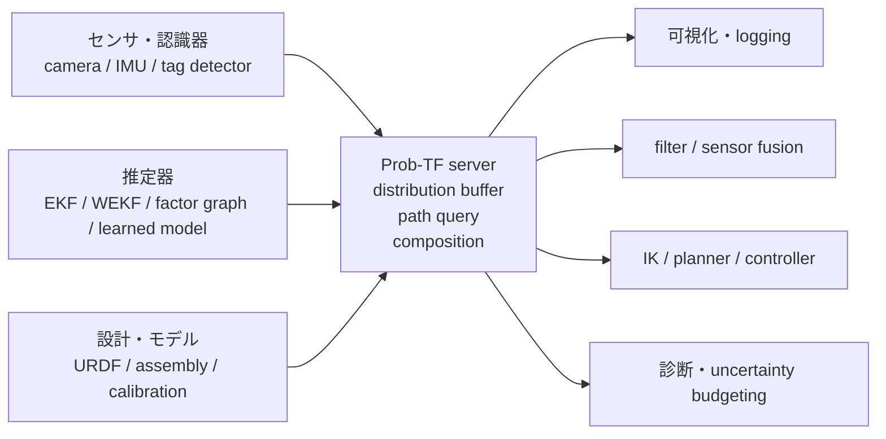
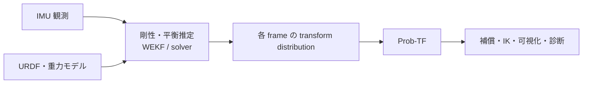
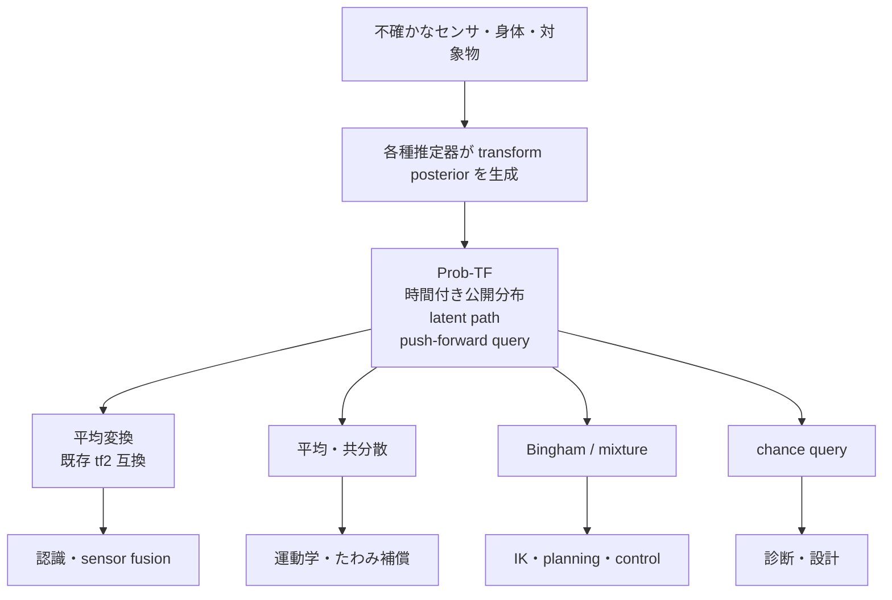

# Prob-TF 横断整理
## 確率的座標変換をロボットシステムの共通基盤にするための概要・思想・定式化・実装例

- 文書作成日：2026-07-12
- 対象：これまで議論してきた Prob-TF / P-TF の全体像
- 表記：本稿では名称を **Prob-TF** に統一する
- 文書の性格：確定済みの設計判断，数理的基礎，試作方針，応用例，未解決課題を一つにまとめた研究・設計メモ

---

## 0. 一文で言えば何か

**Prob-TF は，ロボット内の各座標変換を一つの確定値ではなく確率変数として管理し，フレーム間の変換分布を，通常の TF と同様の問い合わせによって取得できるようにする共通層である．**

通常の TF が

> 「この二つのフレームの間の変換は何か」

に答えるのに対し，Prob-TF は

> 「この二つのフレームの間の変換について，現在どのような確率分布を持っているか」

に答える．

ここで重要なのは，単に `TransformStamped` に共分散を追加することではない．親フレームの回転誤差が，子フレーム以降の位置誤差へ変換されること，順変換と逆変換が同じ確率変数を共有すること，複数の変換間に相関が生じうること，多峰的な姿勢仮説を保ったまま流通させることまで含めて，**座標変換そのものを確率的対象として扱う**ことが中心である．

---

## 1. Prob-TF を考える動機

### 1.1 通常の TF が暗黙に仮定しているもの

通常の TF tree では，各 edge に一つの剛体変換

\[
T =
\begin{pmatrix}
R & t \\
0 & 1
\end{pmatrix}
\in SE(3)
\]

が登録される．この設計は，フレーム間の相対位置・相対姿勢が十分正確に分かっている場合には非常に強力である．

しかし，実際のロボットでは，フレーム間変換は次の理由で確定しない．

- センサによる姿勢・位置の観測誤差
- カメラ外部パラメータや hand–eye calibration の誤差
- 関節角センサの誤差，バックラッシュ，ガタ
- 柔軟関節やリンクのたわみ
- 現場組立されたモジュール間の取付誤差
- 対称物体や遮蔽に起因する複数の姿勢仮説
- 時間変化する剛性，荷重，温度，接触状態
- モデル化されていない変形や故障

通常は，これらの不確かさは SLAM，EKF，物体姿勢推定器，キャリブレーション器，制御器などの内部に個別に閉じ込められる．その結果，あるモジュールが持つ不確かさを，別のモジュールが再利用しにくい．

Prob-TF の発想は，不確かさを推定器の内部事情として閉じ込めず，**座標変換の属性としてシステム全体へ公開する**ことである．

### 1.2 回転誤差は位置誤差になる

Prob-TF の最も基本的な問題は，回転と位置を独立に扱えないことである．

二つの剛体変換を

\[
T_1 = (R_1,t_1), \qquad T_2 = (R_2,t_2)
\]

とすると，合成は

\[
T_1T_2 = (R_1R_2,\ t_1 + R_1t_2)
\]

である．

したがって，上流の \(R_1\) が不確かであれば，下流リンクの並進 \(t_2\) は \(R_1t_2\) としてランダムに回転される．これは，上流の姿勢ノイズが下流の位置ノイズへ変換されることを意味する．

よって，単に

- 回転には回転の分散
- 並進には並進の分散

を別々に持たせ，最後に足すだけでは不十分である．同じランダム回転が複数の下流ベクトルを同時に回すことによる coupling を保存しなければならない．

### 1.3 「身体図式」ではなく「座標変換層」として語る

この研究は，ロボットが自己の身体を「理解する」とは何か，という哲学的な身体図式の議論に依存しなくても成立する．

Prob-TF の立場では，より限定的かつ工学的に，

> ロボット内外に存在する座標系の間の変換を，確率分布として表現・更新・合成・照会する

と定めればよい．

ロボット身体の確率的モデルは，Prob-TF の重要な応用先ではあるが，Prob-TF 自体を身体表現に限定しない．カメラと物体，複数センサ，地図とロボット，ロボット同士など，座標変換が存在する場所には同じ枠組みを適用できる．

---

## 2. Prob-TF の思想：あるべき姿

### 2.1 不確かさを第一級オブジェクトにする

現在の多くのロボットシステムでは，不確かさは各アルゴリズムの内部変数である．Prob-TF では，変換の平均値だけでなく，分布自体を第一級オブジェクトとする．

決定論的変換は Prob-TF と対立するものではない．確率分布が一点に集中した退化分布として，Prob-TF の特殊例に含まれる．したがって，

> 確定値か確率値かを別システムに分けるのではなく，確定値を確率表現の特殊例として扱う

のが自然である．

### 2.2 推定器と流通層を分離する

Prob-TF は，原則として特定のフィルタや推定法そのものではない．

- Tag detector が AR マーカー姿勢の mixture 分布を作る
- IMU と力学モデルを使う WEKF が関節剛性や平衡姿勢を推定する
- SLAM や factor graph が複数 pose の joint posterior を作る
- 学習器が物体姿勢の分布を出力する

これらは **分布の生産者**である．Prob-TF は，生産者が出した座標変換分布を，公開された message 形式で保持し，時間管理し，合成し，問い合わせ可能にする．

したがって，Prob-TF の内部にしか存在せず，外部から意味を参照できない粒子集合や独自潜在表現を唯一の真実として持つべきではない．少なくとも外部 API へ公開される Prob-TF object は，その意味とパラメータが明示された形式で serialize できなければならない．

Monte Carlo sampling は，理論検証，近似精度評価，フォールバック計算には利用できる．しかし，**粒子だけを外部非公開の内部表現として保持し，そこから平均値だけを返す設計は Prob-TF の思想と合わない**．

### 2.3 表現と問い合わせを分離する

Prob-TF は一つの確率分布族に固定されるべきではない．ただし，何でも自由にしてよいという意味でもない．

必要なのは，

1. 変換分布が何を意味するか
2. 合成・逆変換・作用をどう定義するか
3. どの近似を使ったか
4. 何の情報を捨てたか
5. query の戻り値が何を保証するか

を共通化することである．

Bingham，接空間 Gaussian，mixture，moment summary などの表現は backend であり，利用者が必要とするのは共通の query semantics である．

### 2.4 平均値互換を残す

Prob-TF は，初期段階では tf2 を捨てて置き換えるものではなく，tf2 の上または隣に追加する拡張層と考えるのが実務的である．

- 従来ノードには平均変換または代表変換を返す
- Prob-TF 対応ノードには分布を返す
- 必要に応じて covariance，mixture，chance query を選べる
- 時刻付き buffer と lookup の操作感は tf2 に近づける

これにより，すべての既存パッケージを同時に書き換えなくても段階的に導入できる．

### 2.5 不定座標変換との関係

本稿では，設計段階または現在時刻において相対変換が一意に定まらず，観測・組立・変形・推定に応じて実現値が変わりうる座標変換を，関連概念として **不定座標変換** と呼ぶ．

Prob-TF は，不定座標変換をロボットシステム上で扱うための確率的・計算機的基盤と位置づけられる．

- 不定座標変換：何が不定なのかを表す概念
- Prob-TF：その不定性を確率分布として管理・流通・合成・照会する枠組み

現場組立ロボットでは，モジュール間の相対姿勢が設計時に完全には決まらない．たわみ補償では，指令姿勢と実現姿勢の間の変換が剛性・荷重によって変わる．物体認識では，カメラと物体の変換が多峰的にしか分からない．これらを同じ「確率的座標変換」のインターフェースへ載せることが Prob-TF の狙いである．

---

## 3. Prob-TF が「しないこと」

Prob-TF の範囲を明確にするため，非目標も整理しておく．

### 3.1 SLAM や状態推定器そのものではない

SLAM，EKF，particle filter，factor graph は posterior を推定する方法である．Prob-TF は，それらが得た transform posterior をシステム内で利用可能にする層である．

Prob-TF が推定機能を持つ場合でも，それは plugin または上位層であり，Prob-TF の定義そのものではない．

### 3.2 「共分散付き Pose」の言い換えではない

固定された 6 次元局所座標上の Gaussian は，有用な近似の一つである．しかし，

- quaternion の antipodal symmetry
- SO(3) の大域幾何
- 多峰性
- 対称物体
- 回転と並進の nonlinear coupling
- 同じ latent transform の順逆依存性

を一般には表現できない．Prob-TF は 6×6 covariance を含むが，それに限定されない．

### 3.3 すべてを Bingham 分布に閉じる理論ではない

Bingham 分布は quaternion 上の回転不確かさに適している．一方，並進，回転–並進 coupling，mixture，長い連鎖の合成まで，すべてが Bingham 族に厳密に閉じるわけではない．

したがって，

- 内部伝播は moment operator
- 局所評価は tangent Gaussian
- 外部出力の姿勢 summary は moment-matched Bingham
- 多峰性は mixture のまま保持

という hybrid 構成が自然である．

### 3.4 近似した分布を無条件に再合成しない

平均・共分散や moment-matched Bingham は，元の joint law の summary である．summary を新しい独立 edge として graph に戻し，再び合成すると，失われた依存関係を独立と誤認する危険がある．

近似閉包を再利用する場合は，`closure_approximation=true` のように，近似であることを明示すべきである．

---

## 4. 数学的な最小定義

### 4.1 フレームグラフと確率変換

フレーム集合を \(V\)，edge 集合を \(E\) とする graph

\[
G=(V,E)
\]

を考える．各 physical edge \(e\in E\) に対して，剛体変換値確率変数

\[
T_e:\Omega\to SE(3)
\]

を割り当てる．その分布を \(\mu_e\) と書く．

決定論的 TF は，\(\mu_e\) が一点 \(T_e^0\) に集中する場合である．

### 4.2 path query

フレーム \(a\) から \(b\) への reduced path を

\[
p=(e_1^{\sigma_1},\ldots,e_L^{\sigma_L}),
\qquad
\sigma_i\in\{+1,-1\}
\]

とする．path product map を

\[
m_p(T_{e_1},\ldots,T_{e_L})
=
T_{e_1}^{\sigma_1}\cdots T_{e_L}^{\sigma_L}
\]

と定める．

path 上の edge が独立なら，問い合わせ結果の分布は

\[
\mu_{a\to b}
=
(m_p)_*
\left(
\mu_{e_1}\otimes\cdots\otimes\mu_{e_L}
\right)
\]

である．

相関がある場合は，edge ごとの marginal を掛けてはならない．path 上の joint law \(\mu_p\) を用いて

\[
\mu_{a\to b}=(m_p)_*\mu_p
\]

とする．

この式が Prob-TF の最小の数理定義である．単一 edge の問い合わせと長い chain の問い合わせは，\(L=1\) と \(L>1\) の違いにすぎない．

### 4.3 逆変換

逆写像を

\[
\operatorname{inv}(T)=T^{-1}
\]

とする．edge \(e:u\to v\) の逆向き分布は

\[
\mu_{v\to u}
=
\operatorname{inv}_*\mu_e
\]

である．

ただし，これは「逆向き用の別の確率変数を新規生成する」という意味ではない．順向きと逆向きは同じ \(T_e\) の関数であり，sample-wise に

\[
T_eT_e^{-1}=I
\]

が成り立つ．

この依存性を失うと，往復変換が identity に戻らないという重大な問題が生じる．

### 4.4 点・方向・姿勢への作用

点 \(x\in\mathbb{R}^3\) に対する作用を

\[
\alpha(T,x)=Rx+t,
\qquad T=(R,t)
\]

とする．transform distribution \(\mu_T\) と点の分布 \(\nu_x\) が与えられたとき，出力分布は作用写像の push-forward である．

独立なら

\[
\nu_y
=
\alpha_*(\mu_T\otimes\nu_x)
\]

であり，相関があれば joint law を使う．

固定方向 \(v\in S^2\) に対するランダム回転の作用

\[
X=R(Q)v
\]

は，Prob-TF で繰り返し現れる基本 object である．JMAA 論文で扱った Bingham quaternion による単位ベクトルの induced law は，この基本作用を詳細に解析したものと位置づけられる．

### 4.5 時間付き Prob-TF

実システムでは，各 edge は時間に依存する．したがって，より完全には

\[
T_e(t)
\]

または時刻 \(t\) における posterior

\[
\mu_e^t
\]

を保持する．

tf2 と同様に，

- timestamp
- buffer
- 過去時刻の lookup
- interpolation / extrapolation
- stale posterior の扱い

が必要になる．ただし，分布の interpolation は平均 transform の補間より難しく，分布族ごとに定義を明示する必要がある．

---

## 5. 回転によって生じる位置分布

### 5.1 Quaternion Bingham 分布

単位 quaternion を

\[
q=(w,x,y,z)^\top\in S^3
\]

とし，Bingham 分布を

\[
p(q\mid A)
\propto
\exp(q^\top Aq)
\]

で定義する．ここで \(A\) は実対称 \(4\times4\) 行列である．

Bingham 分布は \(q\) と \(-q\) に同じ確率を与えるため，quaternion による回転表現の antipodal symmetry と整合する．

### 5.2 固定ベクトルの induced law

固定ベクトル \(r\in\mathbb{R}^3\) に対して

\[
X=R(q)r
\]

を考える．\(q\) が Bingham 分布に従うとき，\(X\) は球面または半径 \(\|r\|\) の球面上の分布を持つ．

この分布は，関節回転誤差がリンクベクトルの先端位置へどう現れるかを直接表す．Prob-TF においては，単なる数学的副産物ではなく，**rotation-induced positional uncertainty の基本部品**である．

### 5.3 接空間 Gaussian 近似

分布が一つの mode の近くに集中する場合，mode \(v\in S^2\) の接空間 \(T_vS^2\) 上で局所 Gaussian 近似を作れる．

接空間上の変数 \(u\in T_vS^2\) を指数写像で

\[
x=\exp_v(u)
\]

として球面へ戻す．局所的に

\[
u\sim N(0,\Sigma_{\tan})
\]

と近似できれば，球面上の分布を高速に扱える．

ただし，この近似は常に有効ではない．高集中で一つの mode に凝縮する non-polar type が主対象であり，polar type，多峰的な場合，球面曲率の影響が大きい場合には，Gaussian summary が分布形状を十分に表さないことがある．

### 5.4 ambient \(\mathbb{R}^3\) の平均・共分散

接空間 Gaussian を球面へ押し戻した変数 \(x_G\) について，二次までの近似として

\[
\mathbb{E}[x_G]
\approx
\left(
1-\frac{1}{2}\operatorname{tr}\Sigma
\right)v
\]

および

\[
\operatorname{Cov}(x_G)
\approx
\frac{1}{2}\operatorname{tr}(\Sigma^2)vv^\top
+
\Sigma
-
\frac{1}{3}
\left(
\operatorname{tr}(\Sigma)\Sigma+2\Sigma^2
\right)
\]

が得られる．

これは，球面上の回転分布を，リンク先端位置の \(\mathbb{R}^3\) 平均・共分散へ接続するために利用できる．

### 5.5 moment operator

各 random rotation \(R\) に対して

\[
G=\mathbb{E}[R]
\]

および，行列 \(S\) への作用素

\[
\mathcal{T}(S)
=
\mathbb{E}[RSR^\top]
\]

を定義する．

ランダムベクトル \(X\) が \(R\) と独立で，その平均と二次モーメントが既知なら，

\[
Y=RX+a
\]

の平均は

\[
\mathbb{E}[Y]
=
G\mathbb{E}[X]+a
\]

であり，二次モーメントは \(\mathcal{T}\) を使って伝播できる．

この方式の利点は，回転分布の合成を毎回 Bingham 分布へ無理に閉じなくても，位置の平均・共分散を計算できることである．Bingham 分布の二次・四次 quaternion moment から \(G\) と \(\mathcal{T}\) を計算するのが，現在の 6-DoF prototype の基本方針である．

### 5.6 相関がある場合

\(R\) と \(X\) が相関している場合，

\[
\mathbb{E}[RX]
\neq
\mathbb{E}[R]\mathbb{E}[X]
\]

である．

特に inverse transform

\[
T^{-1}=(R^\top,-R^\top t)
\]

では，回転 \(R^\top\) と逆向き並進 \(-R^\top t\) が同じ \(R\) を共有する．したがって，逆向き query を forward edge の marginal summary だけから独立に再構成してはならない．

---

## 6. 高集中極限と既存の \(SE(3)\) 誤差伝播との関係

### 6.1 Prob-TF 側の出発点

Prob-TF の Bingham 系定式化では，まず

\[
R(Q)v
\]

という induced law を考える．これは，回転誤差が実際のロボット幾何に含まれるリンクベクトルへどう作用するかを，球面上の分布として直接記述する考え方である．

### 6.2 Lie 代数近似

回転誤差が小さいとき，

\[
\exp([\omega]_\times)b
=
b-[b]_\times\omega
+
O(\|\omega\|^2)
\]

である．局所的な \(SE(3)\) 誤差を

\[
\xi_i=
\begin{pmatrix}
\rho_i\\
\omega_i
\end{pmatrix},
\qquad
\operatorname{Cov}(\xi_i)=\Sigma_i
\]

とすると，リンク \(i\) から見た下流ベクトル \(b_i\) による手先誤差は，一次近似で

\[
\delta p_i
=
\bar R_{0:i}
\left(
\rho_i-[b_i]_\times\omega_i
\right)
\]

となる．回転誤差を含めれば

\[
\begin{pmatrix}
\delta p_i\\
\delta\theta_i
\end{pmatrix}
=
\begin{pmatrix}
\bar R_{0:i} & -\bar R_{0:i}[b_i]_\times\\
0 & \bar R_{0:i}
\end{pmatrix}
\xi_i
\]

である．

この covariance を各独立 edge について加算する式は，Wang–Chirikjian 型の concentrated Gaussian / Lie algebra covariance propagation と一致する．

### 6.3 研究上の位置づけ

この一致から，次のストーリーが得られる．

> Prob-TF は，Bingham 回転による固定ベクトルの induced law から出発する．その局所 Laplace / tangent Gaussian 極限を取ると，既存の \(SE(3)\) 上の Gaussian covariance propagation が再現される．

したがって，既存の Lie 群誤差伝播を否定する必要はない．むしろ，それを Prob-TF の高集中極限として包含しつつ，

- Bingham の非 Gaussian 性
- quaternion の antipodal symmetry
- polar / non-polar の違い
- 球面上の有限分散効果
- 多峰的姿勢
- Gaussian push-forward の二次補正

を扱えることが Prob-TF 側の拡張性になる．

---

## 7. latent layer と summary layer

これは Prob-TF 実装で最も重要な設計原則の一つである．

### 7.1 latent layer

各 physical edge に一意な `edge_id` を与える．

- `parent -> child` は `EdgeView(edge_id, direction=+1)`
- `child -> parent` は `EdgeView(edge_id, direction=-1)`

として表す．逆向き edge は別の乱数ではなく，同じ latent random transform の inverse view である．

lookup はまず，分布 summary ではなく，どの edge をどちら向きに使用するかを表す `PathExpression` を返す．

### 7.2 path reduction

summary 計算の前に，

\[
e^+e^-
\quad\text{または}\quad
e^-e^+
\]

の隣接対を sample-wise identity として消去する．

この操作を平均変換や marginal covariance に落とした後で行ってはならない．一般に

\[
\mathbb{E}[R]\mathbb{E}[R^\top]\neq I
\]

だからである．

### 7.3 summary layer

reduced path が確定した後にだけ，

- moment propagation
- tangent Gaussian surrogate
- ambient mean / covariance
- moment-matched Bingham
- unimodal Gaussian closure

などを計算する．

summary は原則として terminal output である．元の latent dependency を保持しない summary を，新しい独立 edge として再登録してはならない．

### 7.4 repeated edge

path reduction 後にも同じ physical `edge_id` が複数回残る場合，それらは依存している．初期 prototype では，そのような query は安全のため未対応とし，dependency-aware な高次 moment または factor graph backend が整うまで止める方針が妥当である．

### 7.5 root-to-link と任意 frame 間 query

root から各 link への simple forward path は，独立 edge 仮定の下で moment propagation を適用しやすい．

一方，任意の `source -> target` query には inverse view が含まれうる．逆向き並進 \(-R^\top t\) と回転が結合するため，root-to-link 用の単純な再帰をそのまま流用できない．

したがって初期実装では，

- 任意 frame 間の `lookup_path` は実装する
- full moment summary はまず root-to-link を正式対応する
- 一般 path は，正しい joint propagation が実装されるまで未対応を明示する

という安全側の方針が適切である．

---

## 8. 分布表現の階層

### 8.1 決定論的 transform

一つの \(T\in SE(3)\)．既存 tf2 との互換用であり，Prob-TF では退化分布とみなす．

### 8.2 局所 \(SE(3)\) Gaussian

nominal transform \(\bar T\) と局所誤差 \(\xi\) を

\[
T=\bar T\exp(\xi^\wedge),
\qquad
\xi\sim N(0,\Sigma)
\]

で表す．

高速で既存理論との接続がよいが，大域的な回転，多峰性，強い非 Gaussian 性には弱い．

### 8.3 Bingham rotation + translation summary

回転を Bingham，並進を Gaussian または moment で表す．ただし，回転と並進を完全独立と仮定すると coupling を失うため，必要に応じて cross-covariance または conditional model を持たせる．

### 8.4 mixture transform

対称物体，AR マーカーの誤検出候補，複数解を持つ姿勢推定では

\[
\mu
=
\sum_{\ell=1}^{L}w_\ell\mu_\ell,
\qquad
w_\ell\geq0,
\qquad
\sum_{\ell=1}^{L}w_\ell=1
\]

を用いる．

重要なのは，mixture component index \(\ell\) が，単なる複数サンプルではなく，意味のある仮説ラベルであることである．

### 8.5 AR マーカー用の component 内 coupling

component \(\ell\) において，回転 quaternion を \(Q\)，並進を \(X\) とする．回転行列の vectorization を

\[
\rho(Q)=\operatorname{vec}R(Q)
\]

とし，component の基準回転を

\[
\rho_\ell
=
\operatorname{vec}R_{\mathrm{mode},\ell}
\]

とする．並進の条件付きモデルを

\[
X
=
m_\ell
+
C_\ell
\left(
\rho(Q)-\rho_\ell
\right)
+
\eta_\ell,
\qquad
\eta_\ell\sim N(0,\Sigma_\ell)
\]

と置く．

ここで，

- \(m_\ell\)：基準回転に対応する並進平均
- \(C_\ell\)：回転変動から並進条件付き平均への回帰係数
- \(\Sigma_\ell\)：回転で説明されない residual covariance
- \(R_{\mathrm{mode},\ell}\)：component の基準姿勢

である．

\(\rho(Q)\) に回転行列を使うことで，quaternion の \(q\) と \(-q\) の符号曖昧性を避けられる．

Tag detector がこの分布を生成し，Prob-TF は component weight，Bingham parameter，\(m_\ell\)，\(C_\ell\)，\(\Sigma_\ell\)，\(R_{\mathrm{mode},\ell}\) を公開 message のまま保持・流通させる．Prob-TF 内部だけに粒子を隠し，外部には単一 pose しか返さない設計にはしない．

### 8.6 mixture を一つの Gaussian にまとめる場合

Euclidean 空間の Gaussian mixture

\[
p(x)
=
\sum_{\ell=1}^{L}
w_\ell
N(x\mid m_\ell,\Sigma_\ell)
\]

を一つの Gaussian に moment matching するなら，

\[
\bar m
=
\sum_{\ell=1}^{L}w_\ell m_\ell
\]

および

\[
\bar\Sigma
=
\sum_{\ell=1}^{L}
w_\ell
\left[
\Sigma_\ell
+
(m_\ell-\bar m)(m_\ell-\bar m)^\top
\right]
\]

でよい．

これは，「局所的には自信が強い推定」と「大域探索で得た別仮説」を mixture として混ぜ，その一・二次 moment を使う場合に利用できる．ただし，

- 多峰性そのものは消える
- mode 間が遠いと平均がどの仮説にも対応しない
- \(SO(3)\) や \(SE(3)\) 上では，共通の局所 chart を定めずに直接この式を使えない
- rotation–translation coupling も同時に moment match する必要がある

ため，外部へ返す標準結果として常に unimodal 化するべきではない．

---

## 9. Prob-TF のシステム構成



### 9.1 distribution producer

分布を生成するモジュールである．

- object pose estimator
- AR tag detector
- IMU attitude estimator
- hand–eye calibration
- joint error estimator
- deflection estimator
- SLAM / factor graph
- assembly calibration

### 9.2 Prob-TF transport / query layer

Prob-TF の中核である．

- frame graph 管理
- timestamp 付き分布 buffer
- latent path expression
- inverse view
- path composition
- summary backend
- representation conversion
- approximation metadata
- query result の provenance

### 9.3 consumer

Prob-TF の出力を利用する．

- sensor fusion
- uncertainty-aware forward kinematics
- robust IK
- collision probability evaluation
- grasp planning
- chance-constrained control
- visualization
- logging / replay
- anomaly detection
- calibration planning

### 9.4 tree query と graph posterior

実装上は，二層構成が望ましい．

1. **tree query layer**
   - tf2 に近い高速 lookup
   - 一意な path
   - edge posterior または必要な joint subset を使う
   - 実時間利用を重視

2. **graph posterior layer**
   - loop closure
   - 複数センサ間の相関
   - shared calibration variable
   - 時間相関
   - factor graph / smoothing の joint posterior

tree 上に marginal edge を独立に並べるだけでは，相関した推定結果を正しく扱えない場合がある．その場合，tree は問い合わせの UI とし，背後の graph posterior から path に必要な joint law を抽出する構成が必要になる．

---

## 10. message と API の案

### 10.1 基本 message

名称は仮であるが，少なくとも次の種類が考えられる．

- `TransformDistributionStamped`
- `TransformMixtureStamped`
- `TransformWithCovarianceStamped`
- `TransformMomentStamped`

一つの万能 message にすべてを詰めるより，共通 header と representation-specific payload を分ける方が実装しやすい．

### 10.2 共通 metadata

各 message は少なくとも次を持つべきである．

- `header.stamp`
- `parent_frame_id`
- `child_frame_id`
- `edge_id`
- `representation_type`
- `convention`
  - quaternion scalar-first / scalar-last
  - left / right perturbation
  - body / spatial covariance
- `source`
  - detector，filter，calibration など
- `validity`
- `approximation_flags`
- `closure_approximation`
- `independence_group` または dependency metadata
- `quality / calibration metrics`
- `version`

### 10.3 Bingham payload

- symmetric parameter matrix \(A\)，または eigenvectors + eigenvalues
- normalization convention
- mode quaternion
- diagonal-reducing metadata
- concentration/type information
- non-polar / polar 等の近似可否
- optional second/fourth moments

### 10.4 translation / coupling payload

- translation mean
- translation covariance
- rotation–translation cross-covariance
- または conditional regression \(C_\ell\)
- residual covariance
- reference rotation representation

### 10.5 mixture payload

各 component について，

- weight
- component id
- rotation distribution
- translation distribution
- coupling
- symmetry label / hypothesis metadata
- provenance

を持つ．

### 10.6 query API

概念的には次の query が必要である．

```text
lookup_path(source, target, time)
lookup_distribution(source, target, time, representation)
lookup_mean(source, target, time)
lookup_moments(source, target, time, order)
lookup_mixture(source, target, time)
transform_distribution(object_distribution, source, target, time)
chance_query(event, source, target, time)
```

### 10.7 query result が明示すべきもの

問い合わせ結果は，値だけでなく，

- 使用した path
- 使用した edge ids
- independence assumption
- joint posterior を使用したか
- 近似方法
- 捨てた moment
- closure の有無
- 有効時刻
- 計算失敗・未対応条件

を返すべきである．

Prob-TF では，誤った covariance を黙って返すより，未対応として停止する方がよい．

---

## 11. 実際の定式化・実装例

## 11.1 6-DoF manipulator prototype

### 目的

通常の kinematic tree の各 revolute joint を Bingham random rotation とし，`base_link` から各 link origin までの

- 平均位置
- 位置共分散
- 必要に応じた近似姿勢分布

を計算・可視化する．

### 方針

- 内部伝播：二次・四次 moment に基づく propagation
- 姿勢の外部 summary：必要な場合だけ moment-matched Bingham
- 各 edge の局所可視化：tangent Gaussian surrogate
- root-to-link path を最初の正式対応範囲とする
- inverse edge は別分布として登録しない
- summary 同士の再合成を default で禁止する

### 出力

- link ごとの mean position
- 3×3 covariance
- covariance ellipsoid
- approximate rotation distribution
- 使用 path と method
- CSV / JSON / visualization

この prototype は，「Prob-TF の理論を完全に実装する」ものではなく，まず rotation-induced positional uncertainty を TF tree 上で確認可能にする最小実装である．

## 11.2 二リンクマニピュレータ

二リンクの場合，手先位置は概略

\[
p
=
t_1
+
R_1t_2
\]

または convention に応じた同値な形で書ける．\(R_1\) がランダムなら，第二リンクのベクトル \(t_2\) の先端は球面状に分布する．

JMAA で得た \(R_1t_2\) の induced law またはその tangent Gaussian / ambient moment を使うことで，手先位置の平均・共分散を計算できる．

さらに各 joint の局所 \(SE(3)\) covariance を高集中極限で用いると，Wang–Chirikjian 型の 6×6 covariance propagation と一致する．この例は，

- Prob-TF の非 Gaussian な出発点
- 既存 Lie Gaussian 理論との一致
- rotation–translation coupling の必要性

を同時に示す基本例である．

## 11.3 AR マーカー姿勢の mixture

AR マーカーの四隅の観測には，画像ノイズ，対応付け，平面 pose の複数解，遮蔽などが影響する．detector は単一の最尤 pose だけを出すのではなく，

\[
\sum_\ell w_\ell\mu_\ell
\]

という transform mixture を出力する．

各 component は，

- Bingham rotation
- translation mean / covariance
- rotation–translation coupling
- component weight

を持つ．

Prob-TF は detector の計算を内部で再現するのではなく，その公開された mixture を受け取り，他の camera extrinsic や robot kinematics の分布と合成し，world frame での marker distribution を返す．

この構成では，

> detector が分布を作る  
> Prob-TF が分布を運ぶ  
> planner / filter が分布を使う

という責務分離が明確になる．

## 11.4 たわみ補償

たわみ補償系では，剛性 \(K\)，指令角 \(\theta_{\mathrm{cmd}}\)，静力学平衡姿勢 \(\theta_{\mathrm{eq}}\)，IMU 重力方向観測などを扱う．

現在の構成では，

1. WEKF が \(\log K\) を更新する
2. 現在の実行用剛性 \(K_{\mathrm{exec}}\) から \(\theta_{\mathrm{cmd}}\) を生成する
3. 平衡 solver が \(\theta_{\mathrm{eq}}\) を予測する
4. 推定された実現姿勢から各 frame transform を計算する

という流れである．

Prob-TF との接続では，WEKF 自体を Prob-TF と同一視しない．WEKF は身体パラメータの推定器であり，その posterior から誘導された frame transform distribution を Prob-TF へ publish する．



剛性推定で用いる deterministic particle scan supervisor は，局所解から抜けるための推定器側の補助手段である．これは Prob-TF の public representation を particle-based にすることを意味しない．

## 11.5 現場組立・モジュールロボット

現場で組み立てるロボットでは，モジュールの種類は既知でも，モジュール間の相対姿勢，取付誤差，構造のたわみが事前に完全には分からない．

通常の URDF / TF では，最初から一つの変換を選んで固定する必要がある．Prob-TF では，組立直後は広い分布を持たせ，IMU，カメラ，接触，運動結果などの観測で分布を更新できる．

この用途では，Prob-TF は単にセンサ誤差を表すものではなく，

- 設計時に未決定
- 組立時に初めて実現
- 使用中に変化
- 故障や交換で再構成

される不定座標変換を扱う基盤になる．

## 11.6 sensor fusion

観測 \(z\) が sensor frame で得られ，world frame へ変換する transform 自体が不確かな場合，観測ノイズだけを filter に入れても不十分である．

観測分布と transform distribution の joint push-forward を使い，

\[
p(z_{\mathrm{world}})
\]

を作ってから filter update に接続する必要がある．

Prob-TF は，filter の observation covariance を単に増やすだけでなく，

- transform uncertainty
- observation uncertainty
- 両者の相関
- 多峰性

を統一的に observation model へ渡す接続点になりうる．

---

## 12. いわゆる確率ロボティクスとの関係

### 12.1 共通点

確率ロボティクスは，状態，地図，観測，制御入力の不確かさを posterior として扱う．Prob-TF も，同じ確率論，Bayes 推定，Lie 群，factor graph，Gaussian approximation を利用する．

したがって，Prob-TF は確率ロボティクスと別分野ではなく，その内部に位置づけられる．

### 12.2 違いは「数学」より「システム内の置き場所」

従来の確率ロボティクスでは，不確かさは estimator 内の state posterior として存在することが多い．Prob-TF は，その posterior から必要な relative transform distribution を取り出し，ロボットシステムの共通座標変換層へ公開する．

Prob-TF の特徴は，

- state 推定問題を解くこと自体ではなく
- transform posterior を標準的に照会可能にし
- perception，planning，control の間で共有する

ことにある．

### 12.3 map と state を Prob-TF が初めて共通化するわけではない

map と robot state は，通常の deterministic TF でも同じ座標系へ変換できる．したがって，「Prob-TF が初めて map と state を共通化する」という主張は強すぎる．

Prob-TF が追加するのは，

- 変換そのものの posterior
- transform uncertainty の伝播
- 相関を保った relative transform query
- 下流タスクへの分布インターフェース

である．

### 12.4 factor graph との関係

factor graph は joint posterior を計算する推論基盤である．Prob-TF は factor graph の競合ではなく，factor graph の出力を frame query として利用可能にする front-end / middleware になりうる．

理想的には，

\[
\text{factor graph posterior}
\longrightarrow
\text{relative transform marginal / joint subset}
\longrightarrow
\text{Prob-TF query}
\]

という接続になる．

---

## 13. Prob-TF の研究上の新規性

Prob-TF の新規性を「不確かな剛体変換の合成を世界で初めて考えた」と置くべきではない．stochastic map，Lie 群上の誤差伝播，pose graph，Bingham / Matrix Fisher など，多くの要素は既存研究に存在する．

より妥当な新規性は，次の統合にある．

### 13.1 transform middleware と確率理論の統合

既存理論は estimator 内部の数理として扱われることが多い．Prob-TF は，それを tf2 的な

- frame id
- path lookup
- timestamp
- buffer
- inverse query
- downstream API

へ落とし込む．

### 13.2 induced law から始める幾何的定式化

Prob-TF では，抽象的な 6 次元 covariance だけでなく，

\[
R(Q)v
\]

という，ロボット幾何に実際に現れるベクトルの分布から始められる．これにより，リンク長，方向，対称性，球面幾何が位置誤差にどう影響するかを直接記述できる．

### 13.3 非 Gaussian・多峰的分布の公開

Bingham，polar / non-polar，mixture，対称姿勢を，単一 Gaussian へ即座に潰さず，frame edge posterior として公開する．

### 13.4 相関と逆変換の意味論

順変換と逆変換を同じ latent edge の view として扱い，summary 前に path reduction するという設計は，単なる covariance message より強い意味論を持つ．

### 13.5 センサ・認識・身体推定・制御の共通バス

カメラ外部パラメータ，AR marker，関節誤差，たわみ，組立誤差，object pose を，同じ transform distribution interface に載せる．

Prob-TF の最終的な価値は，個別アルゴリズムの精度向上だけでなく，**幾何的不確かさをモジュール間で再利用できるシステム設計**にある．

---

## 14. Prob-TF が扱う「確率」の役割

これまでの研究全体で，確率は少なくとも次の役割を持つ．

### 14.1 センサ情報の受け口

カメラ，IMU，外界センサ，内界センサが出す不確かさを，filter や estimator へ接続する．Prob-TF は，センサ値そのものより，センサと対象間の transform posterior の受け口になる．

### 14.2 曖昧な姿勢の表現

対称物体や不十分な観測による，本質的に複数解を持つ不確かさを表す．これは単なる小さい測定ノイズではなく，aleatoric ambiguity や multimodality に近い．

### 14.3 身体・構造パラメータの不確かさ

剛性，たわみ，ガタ，組立誤差，関節原点など，ロボット身体を決める量の posterior を transform distribution へ押し出す．

### 14.4 行動選択

「平均的に最も近い」解ではなく，

- 成功確率
- 衝突確率
- 到達確率
- chance constraint
- 観測による不確かさ減少

を基準に行動を選ぶ．

### 14.5 異常検知

予測された transform distribution と観測が継続的に整合しない場合，

- センサ故障
- 緩み
- 破損
- 想定外の接触
- モデル不足

を疑える．Prob-TF は，正常時に期待される幾何分布を共有することで，異常検知の基準を提供できる．

---

## 15. 未解決の重要課題

### 15.1 任意 frame 間の exact / accurate moment propagation

inverse view を含む一般 path では，回転と並進の依存が複雑になる．root-to-link で使える簡単な独立再帰だけでは足りない．

### 15.2 edge 間相関

同じ calibration，関節，地図変数から生成された複数 edge は相関する．marginal edge distributions の積では正しい path distributionを得られない．

必要な方向は，

- joint moment metadata
- dependency graph
- factor graph posterior への参照
- query 時の joint marginal extraction

である．

### 15.3 時間相関

連続時刻の transform posterior は独立ではない．buffer に時刻ごとの marginal だけを保存すると，trajectory-level query や smoothing の情報を失う．

### 15.4 representation conversion

Bingham，tangent Gaussian，6×6 covariance，mixture の間の変換は，一般に情報を失う．

- どの moment を保存するか
- 近似誤差をどう評価するか
- conversion の適用条件
- polar / non-polar の判定
- multimodality を潰したか

を metadata として返す必要がある．

### 15.5 mixture の増大

複数 mixture edge を合成すると component 数が増える．component merge や pruning の具体方針は現時点では固定していない．まずは mixture を正しく表現・合成する意味論を優先し，近似的な縮約は別問題として扱うべきである．

### 15.6 calibration の評価

covariance や credible region が実際の誤差頻度と一致するかを確認しなければならない．

- coverage rate
- NLL
- calibration curve
- Wasserstein / total variation
- endpoint error
- task success probability

などの評価が必要である．

### 15.7 計算量

実時間 query では，毎回 full density を数値積分できない．

- moment cache
- representation-specific fast path
- approximation quality flag
- offline exact / online approximate の分離

が必要になる．

### 15.8 標準化

message 名，座標 convention，perturbation convention，covariance の frame，quaternion convention が曖昧だと，相互運用できない．数学以上に，仕様の明示が重要である．

---

## 16. 段階的な実装ロードマップ

### Phase 1：root-to-link prototype

- URDF tree 読み込み
- Bingham joint rotation
- 二次・四次 moment propagation
- link origin の平均・共分散
- covariance ellipsoid 可視化
- latent `edge_id` / `EdgeView`
- inverse edge の独立登録禁止

### Phase 2：公開 message と tf2 互換 API

- `TransformDistributionStamped`
- mean transform query
- moment query
- timestamp buffer
- approximation metadata
- logging / replay

### Phase 3：mixture と AR marker

- `TransformMixtureStamped`
- component weight
- Bingham rotation
- translation conditional coupling
- camera extrinsic distribution との合成
- world-frame marker distribution

### Phase 4：推定器との接続

- IMU attitude
- camera calibration
- deflection WEKF
- learned object pose
- joint error estimation

各推定器は Prob-TF の内部実装に埋め込まず，distribution producer として接続する．

### Phase 5：一般 path と相関

- inverse view を含む general moment propagation
- joint edge posterior
- factor graph backend
- correlated subtree query
- loop を含む graph への拡張

### Phase 6：planning / control

- robust IK
- chance-constrained collision check
- grasp success probability
- active calibration
- uncertainty-aware task planning

---

## 17. 博論・研究全体での説明案

### 17.1 中心問題

ロボットでは，センサ，アクチュエータ，身体構造，対象物の認識に由来する不確かさが，最終的には座標変換の不確かさとして現れる．しかし，従来のロボットソフトウェアでは，座標変換層は基本的に決定論的であり，不確かさは個別の推定器内部に分散している．

### 17.2 提案

各フレーム間変換を \(SE(3)\)-値確率変数として表し，フレーム chain に沿った合成を分布の push-forward として定義する Prob-TF を提案する．

### 17.3 数理的基盤

Bingham 分布に従う quaternion が固定ベクトルを回転したときの induced spherical law を解析し，その局所 Gaussian 近似と ambient mean / covariance を導く．これを連結座標系に適用し，回転不確かさが下流位置へ伝播する構造を定式化する．高集中極限では，既存の \(SE(3)\) Gaussian covariance propagation と一致する．

### 17.4 システム的貢献

Prob-TF を，推定器・認識器が生成した transform posterior を公開形式で流通させる middleware として設計する．順逆変換の latent identity，相関，mixture，時間 buffer，近似 metadata を含む query semantics を与える．

### 17.5 応用

- Bingham 回転誤差を持つ manipulator の手先分布
- AR marker の mixture pose
- IMU と力学モデルによるたわみ推定
- 現場組立ロボットの不定座標変換
- uncertainty-aware control / planning

### 17.6 最も強い主張

Prob-TF の最も強い意義は，新しい一種類の分布を導入することではない．

> ロボットシステムに散在していた幾何的不確かさを，座標変換 posterior という共通 object に変換し，通常の TF と同じように照会・再利用できるようにすること

にある．

---

## 18. 現時点で確定しているものと，まだ仮説であるもの

### 18.1 数学的に確立・利用可能

- transform composition は \(SE(3)\) の積である
- path distribution は積写像の push-forward である
- inverse distribution は inversion map の push-forward である
- 相関がある場合は joint law が必要である
- Bingham quaternion から回転された固定ベクトルの induced law を構成できる
- 高集中 non-polar regime では tangent Gaussian 近似が使える
- 二次・四次 moment から位置の moment propagation を構成できる
- 高集中極限で Lie algebra covariance propagation と接続できる

### 18.2 現時点の設計判断

- Prob-TF は推定器ではなく distribution transport / query layer を中核とする
- public representation を持ち，外部参照不能な内部粒子だけに依存しない
- latent layer と summary layer を分離する
- inverse は同じ physical edge の view として扱う
- summary を独立 edge として無条件に再利用しない
- 初期 prototype は root-to-link を優先する
- 内部主計算は moment-based propagation
- Bingham moment matching は必要時の closure
- mixture component 内で rotation–translation coupling を明示できるようにする

### 18.3 今後検証すべき仮説

- Prob-TF が sensor fusion の精度・calibration を実際に改善する
- robust IK や planning の task success を改善する
- 現場組立ロボットの立上げ時間を短縮する
- 異常検知や uncertainty budgeting に有効である
- ROS の標準的 middleware として受け入れられる
- 非 Gaussian 表現を保持する計算コストに実務上の価値がある

これらは有望な方向ではあるが，実験による検証が必要である．

---

## 19. 用語集

| 用語 | 本稿での意味 |
|---|---|
| Prob-TF | 座標変換を確率分布として管理・合成・照会する枠組み |
| P-TF | Prob-TF の旧称・略称として使われてきた表記 |
| 不定座標変換 | 設計時または現在時刻に相対変換が一意に定まらない座標変換 |
| physical edge | 一つの実在するフレーム間関係を表す edge |
| latent edge | summary 前の，同じ random transform を参照する確率的 object |
| inverse view | 同じ physical edge の逆写像であり，別の独立 edge ではない |
| path expression | edge id と向きの列として表された問い合わせ経路 |
| summary | 平均，共分散，近似 Bingham など，元の分布を縮約した結果 |
| closure approximation | 分布族に閉じるための近似 |
| induced law | random transform を点・ベクトル等へ作用させて得られる分布 |
| moment operator | \(S\mapsto\mathbb{E}[RSR^\top]\) のような moment 伝播作用素 |
| coupling | 同じ回転変数が並進・下流ベクトルへ作用することによる依存 |
| transform posterior | 観測後のフレーム間変換の確率分布 |
| distribution producer | transform posterior を生成して Prob-TF へ publish する推定器 |
| chance query | ある幾何条件を満たす確率を返す問い合わせ |

---

## 20. 最終的な見取り図



Prob-TF の中心は，単に「TF に誤差棒を付ける」ことではない．

1. transform を random variable とする
2. path query を push-forward として定義する
3. inverse と相関を latent level で守る
4. 必要な表現へ明示的に近似する
5. 分布を perception–planning–control 間で共有する

という一連の設計思想にある．

最終的には，ロボットシステムにおける座標変換を，単なる前処理やユーティリティではなく，**ロボットが現在信じている幾何学的世界の posterior** として扱うことが Prob-TF の目標である．
