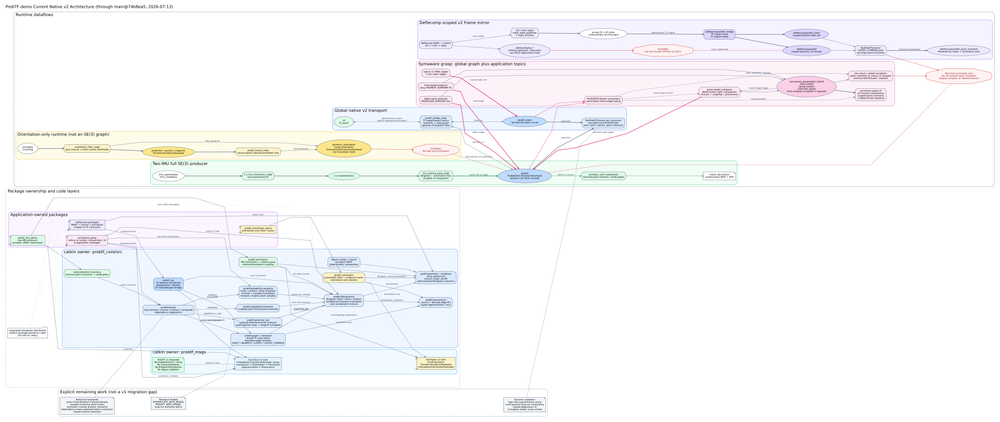

# ProbTF-demo 現行アーキテクチャ

- スナップショット日時: 2026-07-12 22:30:00 JST
- 対象: `main`、`2846fce`
- 対象範囲: root Python package、ROS 1/catkin package、実行 node、主要 topic/TF、example application、テスト境界
- DOT source: [`current-architecture_2026-07-12_223000.dot`](./current-architecture_2026-07-12_223000.dot)
- rendered graph: [`current-architecture_2026-07-12_223000.svg`](./current-architecture_2026-07-12_223000.svg)

この文書は、将来案ではなく上記 commit に存在するコードと設定のスナップショットである。
以前の [`current-implementation_2026-07-12_172230.md`](./current-implementation_2026-07-12_172230.md)
は graph/time/kernel の実装前を記録した移行資料であり、現在の構成説明には本書を使う。
数理 contract の詳細は
[`probtf_jmaa_kernel_architecture.md`](../probtf_jmaa_kernel_architecture.md) を参照する。

## 0. 結論

現在の `ProbTF-demo` は、単一の ROS package ではなく、次の四層を同じ
repository に収めた統合 project である。

1. `src/probtf`: ROS 非依存の確率的 transform foundation
2. `src/probtf_estimators`: IMU producer、orientation filter、same-edge fusion
3. `ros/core`: ROS message と、ProbTF v2/TF を接続する transport boundary
4. `src/symaware_grasp`、`src/deflecomp_*` と `ros/examples`: application と demo

この文書での `v1` / `v2` は ROS の version ではなく、ProbTF-demo 内の
probabilistic transform 表現の世代を指す。

- `v1`: 既存 demo / application が使っている legacy 表現。主な ROS message は
  `ProbabilisticTF` / `ProbabilisticTFArray` で、位置 Gaussian と姿勢 Bingham を
  独立な summary として持つ。
- `v2`: 今回整理した foundation / graph / bridge 側の表現。主な ROS message は
  `ProbabilisticTransformStamped` / `ProbabilisticTransformArray` で、component mixture、
  rotation/translation coupling、provenance、approximation metadata を保持する。

また、`共通 v2 bridge` は
[`probtf_bridge_node.py`](../../ros/core/probtf_core/nodes/probtf_bridge_node.py) を指す。
ここでの "generic" は「任意の demo topic を自動で拾う」という意味ではない。
IMU、orientation、symaware grasp などの application 固有 topic に依存せず、
`/probtf(_static)` と `/tf(_static)` の共通 transport boundary だけを扱う、という意味である。

最も重要な現状は、**v2 foundation/bridge と producer demo の wire format がまだ
一つに接続されていない**ことである。

- 共通 v2 bridge の `/probtf` と `/probtf_static` は v2
  `ProbabilisticTransformStamped/Array` を扱う。
- two-IMU、orientation、symaware grasp の現在の node は、個別 topic に v1
  `ProbabilisticTF/Array` を publish する。
- v1/v2 変換関数はあるが、それを relay する runtime node は launch されない。

したがって、demo を起動しただけでは、その出力は bridge 内の `ProbTfGraph` に
登録されない。これは DOT でも赤い `CURRENT RUNTIME GAP` として示している。

## 1. Repository の物理構成

```text
ProbTF-demo/
  src/
    probtf/                    # v2 foundation と v1 compatibility
    probtf_estimators/         # producer / estimator algorithms
    symaware_grasp/            # symmetry-aware grasp application
    deflecomp_core/            # deflection compensation core
    deflecomp_sim/             # flexible-joint simulation
    deflecomp_examples/        # ROS 非依存 example entry points
  ros/
    core/
      probtf_msgs/             # v1/application + v2 ROS messages
      probtf_core/             # probtf_ros adapter と bridge node
    examples/
      probtf_imu_demo/
      probtf_orientation_demo/
      symaware_grasp/
      deflecomp/               # 6 catkin packages
  third_party/
    BinghamNLL/                # pinned git submodule
  tests/                       # ROS-free unit/boundary tests
  docs/
```

root distribution は `probtf-integrated==0.1.0` で、Python 3.8 以上を対象にする。
[`setup.py`](../../setup.py) は root `src/` の namespace と submodule 内の
`bingham` namespace をまとめて install する。

| Python namespace | 現在の責務 |
| --- | --- |
| `probtf` | distribution、graph/time、lazy kernel、ISL protocol、moment、設定、symbolic URDF |
| `probtf_estimators` | IMU preprocessing/relative pose、orientation、evidence fusion、coupling 推定 |
| `symaware_grasp` | grasp target、hand belief、symmetry-aware IK、旧 ProbTfTree |
| `deflecomp_core` | robot model、equilibrium、stiffness estimator、command generation |
| `deflecomp_sim` | flexible-joint dynamics、synthetic IMU、external wrench |
| `deflecomp_examples` | offline/flexible simulation の console entry point |
| `bingham` | BinghamNLL submodule の normalizer 実装 |

必須 Python dependency は NumPy、SciPy、Pinocchio (`pin`)、PyYAML、
numpy-quaternion である。BinghamNLL submodule が未初期化なら root install は
明示的に失敗する。

## 2. 依存方向と境界

現在の意図された依存方向は次の通りである。

```text
probtf_estimators  --------->  probtf  --------->  BinghamNLL / NumPy / SciPy
probtf_ros         --------->  probtf + probtf_msgs + ROS 1
producer demos     --------->  probtf_estimators + probtf_ros + probtf_msgs
symaware_grasp     --------->  probtf + probtf_msgs
deflecomp_*        --------->  deflecomp_core + Pinocchio
                                  |
                                  +---- narrow use of probtf.geometry
```

foundation から producer、ROS、application への逆依存は禁止されている。
[`tests/test_ros_boundary.py`](../../tests/test_ros_boundary.py) は AST を用いて、
次を検査する。

- root `src/` package が `rospy`、`tf2_ros`、ROS message package を import しない。
- `probtf` が `probtf_estimators` や example を import しない。
- 共通 `probtf_ros` bridge が estimator を import しない。
- catkin `probtf_core` が root `probtf`、`probtf_estimators`、`bingham` を
  再 package 化しない。
- core ROS package が bridge node だけを install し、producer node を所有しない。

`probtf_core` の [`setup.py`](../../ros/core/probtf_core/setup.py) が install する
Python namespace は `probtf_ros` だけである。このため、catkin build より先に
root project を install する必要がある。

## 3. `probtf` foundation

### 3.1 Frame と数値規約

physical edge `(parent, child)` は、child frame の点を parent frame へ写す
次の action を表す。

\[
z_{parent}=R(Q)z_{child}+X
\]

主な内部規約は次の通りである。

| 項目 | 規約 |
| --- | --- |
| quaternion | `[w, x, y, z]` |
| ROS quaternion | field は `x, y, z, w`。adapter でのみ並べ替える |
| `vec(R)` | column-major |
| rotation/translation coupling | `C: 3 x 9` |
| perturbation | reference rotation に対する right perturbation |
| query order | `lookup_kernel(target_frame, source_frame, ...)`。source から target への action |

`EdgeDirection.FORWARD` は child から parent への physical action、`INVERSE` は
同じ latent edge を逆向きに見る view である。inverse 用の独立 distribution は
作らない。

### 3.2 v2 joint distribution model

中心となる immutable domain model は
[`src/probtf/distributions`](../../src/probtf/distributions) にある。mixture の
component `l` は、概念的に次を保持する。

\[
Q\mid L=l\sim \operatorname{Bing}(A_l)
\]

\[
X\mid Q=q,L=l\sim \mathcal N\left(
m_l+C_l(\operatorname{vec}R(q)-\operatorname{vec}R_{ref,l}),S_l
\right)
\]

これは position Gaussian と orientation Bingham を単に並べた v1 model と異なり、
`C_l` により rotation/translation coupling を保存できる。

| 型 | 内容 |
| --- | --- |
| `BinghamOrientation` | `FINITE_BINGHAM`、`DIRAC`、`UNIFORM` を別 kind として保持 |
| `ConditionalGaussianTranslation` | reference での mean、residual covariance、`C` |
| `TransformComponent` | raw weight と joint orientation/translation hypothesis |
| `TransformDistribution` | component mixture、weight status、representative policy |
| `TransformDistributionStamped` | parent/child、stamp、edge ID、authority、static flag、metadata |

Bingham orientation は trace-zero JMAA shape と inverse concentration を分けて保存する。
Dirac を有限 Bingham parameter に偽装せず、uniform も独立 kind にする。

mixture weight は保存時には raw value のままである。利用時に負値を 0 へ clamp して
診断を残し、正の mass で正規化する。全て非正なら `ZERO_MASS`、NaN/Inf を含むなら
`INVALID` であり、identity transform に置き換えない。

deterministic representative は、分布が実際に deterministic な場合だけ exact である。
stochastic mixture の mode を必要とする場合は、
`HIGHEST_WEIGHT_COMPONENT_MODE` などの policy を呼び出し側が明示する。

### 3.3 Provenance と approximation

[`src/probtf/provenance`](../../src/probtf/provenance) は、source ID、派生元 edge、
method、詳細を component/transform ごとに保持する。approximation は
`TANGENT_SURROGATE`、`MOMENT_SUMMARY`、`BINGHAM_CLOSURE`、
`REPRESENTATIVE_PROJECTION`、`UNAVAILABLE` などを型で区別し、`lossy` と
error bound の有無を保持できる。

この metadata は説明用文字列だけではない。kernel evaluator は repeated latent
dependency を検出した場合、独立 sample とみなさず `DEPENDENCY_UNRESOLVED` を返す。

### 3.4 Graph と time buffer

[`ProbTfGraph`](../../src/probtf/graph/query.py) は次の二要素を所有する。

1. `ProbTfTopology`: disconnected component を許す TF-style forest
2. edge ID ごとの `EdgeTimeBuffer`: timestamp 順の static/dynamic record history

topology は multiple parent と cycle を拒否する。parent change は既定で拒否され、
`REPLACE_WITH_DIAGNOSTIC` を指定した場合だけ診断付きで置換する。

buffer は out-of-order insert を timestamp 順に並べる。同一 timestamp で authority が
衝突した場合の既定 policy は `REJECT` で、`REPLACE` と `KEEP_FIRST` も選べる。
一つの physical edge に static/dynamic record を混在させることはできない。
static edge は time invariant で、同一 authority の同一 payload の再送だけを許す。

| Temporal policy | 実装状況 | 現在の意味 |
| --- | --- | --- |
| `EXACT` | 実装済み | 指定 stamp と完全一致する sample |
| `NEAREST_WITHIN_TOLERANCE` | 実装済み | tolerance 内の最近傍。tie は古い sample |
| `LATEST` | 実装済み | 指定時刻以前の最新。任意 `max_age` |
| `LATEST_COMMON` | 実装済み | path の最新共通時刻と zero-order hold |
| `INTERPOLATE_WITH_MODEL` | interface のみ | `UNSUPPORTED_TEMPORAL_POLICY` |
| `PREDICT_WITH_MODEL` | interface のみ | `UNSUPPORTED_TEMPORAL_POLICY` |

`LATEST_COMMON` は Bingham mixture を補間しない。dynamic edge の availability interval
から最新共通時刻を選び、各 edge はその時刻以前の最新 sample を使う。sample stamp が
共通時刻と違う場合は `LATEST_COMMON_ZERO_ORDER_HOLD` 診断を残す。

### 3.5 Lazy kernel と評価

graph lookup は distribution を lookup 時点で潰さず、path と record から lazy
expression を返す。

```python
kernel = graph.lookup_kernel(
    target_frame="world",
    source_frame="tool0",
    stamp=stamp,
    policy=TemporalPolicy.LATEST,
)
```

expression は `IdentityTransformKernel`、`ForwardEdgeKernel`、
`InverseEdgeKernel`、`MixtureTransformKernel`、`ComposedTransformKernel` で構成される。
sampling、moment closure、mixture reduction は lookup の副作用として行わない。

[`KernelEvaluator`](../../src/probtf/kernels/evaluation.py) の現在の評価範囲は次である。

| Representation / operation | 現在の status |
| --- | --- |
| lazy `EXPRESSION` | 実装済み |
| deterministic forward/inverse/composition | exact |
| stochastic forward point first/second moments | 計算済み。返り値は lossy な `MOMENT_SUMMARY` |
| Dirac/uniform/zero-vector induced law | exact special case |
| finite-Bingham exact ISL density | `UNAVAILABLE_EXACT_ISL_BACKEND` |
| tangent leading-exponent surrogate | 明示的な `TANGENT_SURROGATE` |
| stochastic inverse covariance | unavailable |
| stochastic sampling | unavailable。deterministic point の repeat のみ |
| composed stochastic numerical law | unavailable |
| closed-mixture projection | explicit reduction policy/backend 未実装 |

forward moment evaluator は coupling を保持したまま `E[Y]` と `Cov[Y]` を計算する。
ただし first/second moments は元の joint law と同一ではないため、結果を新しい独立 edge
として graph に再登録しない。

### 3.6 補助 module と compatibility

| module | 現在の位置付け |
| --- | --- |
| `geometry` | quaternion、rotation、`DeterministicTransform`、`vec(R)` helper |
| `probability` | Bingham/rotation/point moment summary。`probability.bingham` は alias |
| `spherical_law` | induced spherical law protocol と backend adapter |
| `isl` | `spherical_law` の short compatibility alias |
| `models` | v1 `GaussianPosition`、`BinghamRotation`、`ProbabilisticTransform` |
| `compatibility.legacy` | v1 one-component `C=0` embedding と明示 policy 付き v2 projection |
| `sensor_config` | generic sensor schema と既存 deflecomp schema の YAML parser |
| `symbolic_urdf` | placeholder の検査と deterministic materialization |

v2 から v1 へ戻す際、mixture/coupling を暗黙に捨てない。exact policy で表現できない場合は
失敗し、lossy projection は明示 policy と診断を必要とする。Dirac orientation には有限
v1 Bingham encoding がないため、v1 へ偽装して出力しない。

## 4. `probtf_estimators`

producer algorithm は
[`src/probtf_estimators`](../../src/probtf_estimators) に分離され、foundation へのみ
依存する。

| module | 入力と処理 | 出力 |
| --- | --- | --- |
| `imu_preprocessing` | sliding window の局所多項式 fit | angular velocity/acceleration、specific force と covariance |
| `imu_relative_pose` | vector alignment Bingham、剛体加速度式、information-form RLS | v1 domain `ProbabilisticTransform` |
| `orientation_imu` | gyro cubature prediction、gravity/magnetic likelihood | Bingham prediction/evidence/posterior |
| `evidence_fusion` | 同じ directed frame pair の独立 source を自然 parameter 加算 | `FusedTransformEvidence` |
| `coupling_from_hessian` | `Hxx`、`Hxu` と right perturbation Jacobian | v2 用 `C: 3 x 9` |
| `ros_conversions` | message object と time/message factory の duck typing | estimator message conversion |

`evidence_fusion` は path composition ではない。同じ edge に対する likelihood/prediction
を融合する API で、重複 `source_id` は既定で拒否する。

`ros_conversions` という名前だが ROS module を import しない。呼び出し側が message type
と time factory を注入するため、root Python package の ROS-free 境界を維持する。

## 5. ROS 1 boundary

### 5.1 catkin package

`ros/` 以下には現在 11 catkin package がある。

- core: `probtf_msgs`, `probtf_core`
- producer/application: `probtf_imu_demo`, `probtf_orientation_demo`, `symaware_grasp`
- deflecomp: `deflecomp_core`, `deflecomp_sim`, `deflecomp_ros`,
  `deflecomp_examples`, `deflecomp_description`, `deflecomp_debug`

`probtf_msgs` は 15 message を生成する。`.srv` と `.action` はなく、repository 内に
`rospy.Service` や action server もない。process 間 coordination は topic、TF、
parameter、timer、`wait_for_message` で行う。

### 5.2 Message 世代

ここでの `v1` / `v2` は ProbTF message schema の世代名である。ROS 1 / ROS 2
の区別ではない。

| 系統 | Message | 用途 |
| --- | --- | --- |
| v2 foundation wire | `BinghamOrientation`, `ConditionalGaussianTranslation`, `ProbabilisticTransformComponent`, `ProbabilisticTransformStamped`, `ProbabilisticTransformArray`, `ApproximationInfo`, `Provenance` | joint component mixture、coupling、metadata を保持 |
| v1/application wire | `ProbabilisticTF`, `ProbabilisticTFArray`, `BinghamDistribution`, `GaussianPosition` | 独立 position/orientation summary |
| producer/application | `TransformEvidence`, `ImuKinematics`, `GraspCandidate`, `IKResult` | demo 固有データ |

v2 `ProbabilisticTransformStamped.header.frame_id` が parent frame の唯一の wire field である。
child、edge ID、authority、static flag、representative kind、component mixture、provenance、
approximation を一つの record に含む。

### 5.3 `probtf_bridge_node`

[`probtf_bridge_node.py`](../../ros/core/probtf_core/nodes/probtf_bridge_node.py) は process 内に
`ProbTfGraph`、`ProbTfListener`、`ProbTfBroadcaster`、`ProbTfTfBridge` を持つ。
本書ではこれを `共通 v2 bridge` と呼ぶ。application 固有の producer topic を
subscribe する node ではなく、v2 `/probtf(_static)` と TF の境界を扱う node である。

```text
/tf, /tf_static
       <-> probtf_bridge_node <-> /probtf, /probtf_static
                   |
                   +-> in-process ProbTfGraph
```

| Interface | Type / behavior |
| --- | --- |
| `/probtf` | v2 `ProbabilisticTransformStamped`、dynamic edge |
| `/probtf_static` | v2 `ProbabilisticTransformArray`、全 static set を latched publish |
| `/tf`, `/tf_static` | `tf2_msgs/TFMessage` |
| `~import_tf` | 既定 `true` |
| `~export_tf` | 既定 `true` |
| `~tf_export_policy` | 既定 `exact_only` |

TF import は deterministic transform を Dirac orientation、zero residual covariance、
`C=0` の one-component v2 record にする。authority は ROS connection の caller ID から
保持する。

ProbTF から TF へ出す場合、deterministic edge は exact に export できる。stochastic edge
は既定の `exact_only` では拒否され、stored representative または highest-weight
component mode policy を明示した場合だけ代表値を export する。

bridge は own caller ID と export signature の両方で即時 re-import loop を防ぐ。
`/probtf_static` broadcaster は static record を edge ID ごとに cache し、late subscriber
が全 set を受け取れるよう毎回 array 全体を latch する。

bridge 内 graph に対する ROS service/action の query endpoint はない。別 process が
`lookup_kernel` を呼ぶための RPC ではなく、現在は transport、TF conversion、内部蓄積
までを担当する node である。

### 5.4 v1/v2 runtime gap

library には次の adapter がある。

- `probtf.compatibility.legacy`: v1 domain object と v2 distribution/record
- `probtf_ros.legacy_conversions`: v1 ROS message と v2 record

しかし、これらを subscribe/publish する変換 node は存在しない。ここが、現在の
各種 demo system と v2 `ProbTfGraph` / 共通 v2 bridge の間に残っている実行時の溝である。
さらに
`legacy_message_to_v2_record` は position または orientation が欠ける v1 message を
zero-fill せず拒否する。このため orientation-only posterior は、そのままでは完全な v2
transform record にならない。

現在の runtime は次の二系統である。

| 系統 | Producer / consumer | Graph への登録 |
| --- | --- | --- |
| v2 `/probtf(_static)` | bridge または外部 v2 publisher | bridge 内 `ProbTfGraph` に登録 |
| 個別 v1 topic | IMU/orientation/symaware demo | 自動登録なし |

## 6. Demo と application の実行時構成

### 6.1 Two-IMU relative pose

entry point は
[`two_imu_relative_pose.launch`](../../ros/examples/probtf_imu_demo/launch/two_imu_relative_pose.launch)
である。

```text
/imu_parent/data ----> parent_imu_kinematics --+
                                                  +-> ApproximateTimeSynchronizer
/imu_child/data -----> child_imu_kinematics ---+          |
                                                           v
                                            imu_relative_pose_node
                                                           |
                                      /imu_relative_pose/relative_pose (v1)
                                                           |
                             symbolic_urdf_materializer [optional]
                                      |                    |
                              /robot_description    materialized_urdf
                                      |
                              robot_state_publisher -> TF
```

preprocessor の launch default は window 9、2 次多項式、最小 5 sample である。
二つの `ImuKinematics` は queue 20、slop 0.02 s の
`ApproximateTimeSynchronizer` で同期される。

relative-pose estimator は angular velocity/acceleration の alignment から Bingham
orientation を更新し、剛体運動式

\[
R f_{child}-f_{parent}=([\omega]_{\times}^{2}+[\alpha]_{\times})r
\]

を Gaussian RLS で解いて child IMU origin の position を推定する。

`sensor_mount_tf_node` は YAML から既知 mount を `/tf_static` に出す。現在の default
config は `world -> imu_parent` のみを宣言し、推定対象 `imu_parent -> imu_child` は
deterministic mount として出さない。

`materialize_urdf=true` の場合、position variance と orientation concentration が閾値を
通過してから symbolic placeholder を埋め、`/robot_description` parameter と latched
`materialized_urdf` String を生成する。現在の launch は materializer と
`robot_state_publisher` を同時に起動するため、運用時は parameter 生成前の起動順を確認する
必要がある。また materialized URDF と sensor mount node の両方が
`world -> imu_parent` を表すため、TF authority の重複にも注意が必要である。

### 6.2 Orientation producer

entry point は
[`orientation_filter.launch`](../../ros/examples/probtf_orientation_demo/launch/orientation_filter.launch)
である。

```text
/imu/data + /imu/mag
          |
          v
orientation_filter_node
  |       |         |          +-> posterior (v1 ProbabilisticTF)
  |       |         |
prediction  gravity  magnetic evidence (TransformEvidence)
          \     |     /
           orientation_fusion
                  |
                fused (v1 ProbabilisticTF)
```

filter は gyro prediction と gravity likelihood を常に作り、`use_magnetometer=true` かつ
最新 magnetic sample が age 条件を満たす場合に magnetic likelihood を加える。
同じ update 内で内部 posterior も publish する。

別 node の `orientation_fusion` は各 evidence topic の最新値がそろい、stamp skew が
既定 0.1 s 以下の場合に source-aware fusion を行う。magnetometer 無効時は prediction と
gravity の二 source、有効時は magnetic を含む三 source である。

`posterior` と `fused` はどちらも v1 で、launch 内に `/probtf` への relay はない。

### 6.3 Symmetry-aware grasp

root `symaware_grasp` は grasp library、object-to-grasp composition、hand belief、
symmetry-aware IK と、旧 `symaware_grasp.prob_tf.ProbTfTree` を持つ。

標準
[`probabilistic_tf_demo.launch`](../../ros/examples/symaware_grasp/launch/probabilistic_tf_demo.launch)
の主な流れは次である。

```text
object_pose_node -> object_prob_tf (v1)
                    |-> PTF visualizer
                    +-> grasp target composer -> grasp_target_ptfs (v1 array)

robot_controller -> joint_states -> robot_state_publisher -> TF
                         |
                         +-> hand belief -> hand_prob_tf (v1) -> visualizer
```

重要な実行時事実として、標準 launch は `symmetry_aware_ik_node.py` を起動しない。
この node は install されているが、手動実行時にだけ `grasp_target_ptfs` と
`joint_states` を一度読み、probabilistic/baseline IK を解いて次を publish する。

- `target_joint_states`
- `symmetry_aware_ik_result`
- `deterministic_ik_result`
- `selected_grasp_target_prob_tf`

したがって標準 launch だけでは controller は初期姿勢を publish し続け、selected target
visualizer は入力待ちになる。IK は action server ではなく one-shot process である。

別の `prob_tf_link_cloud.launch` は YAML から旧 `ProbTfTree` を構築し、tangent surrogate
で link axis endpoint cloud を生成する。この runtime は core `ProbTfGraph` ではなく旧
tree lookup を直接使う。旧 tree には `to_core_graph()` と `lookup_core_kernel()` があり、
one-component uncoupled edge として新 foundation に埋め込めるが、これは in-process API
であって ROS transport relay ではない。

### 6.4 Deflection compensation

deflecomp は ProbTF topic/graph から独立した application branch である。

| package / namespace | 現在の責務 |
| --- | --- |
| `deflecomp_core` | Pinocchio robot、spring/equilibrium、IMU observation、WEKF、control pipeline |
| `deflecomp_sim` | flexible-joint dynamics、equilibrium、synthetic multi-frame IMU |
| `deflecomp_ros` | controller node、static IMU TF、launch/config |
| `deflecomp_examples` | offline/flexible example wrapper |
| `deflecomp_description` | URDF と RViz config |
| `deflecomp_debug` | stiffness/covariance plotter |

full demo の feedback loop は次である。

```text
/ref/joint_states
       |
       v
deflecomp_node -- /cmd/joint_states --> deflecomp_sim
       ^                                  |
       |                                  +-> /equil/joint_states
       +------------- /imu ---------------+
```

`deflecomp_node` は frame ごとの IMU buffer、Bingham direction likelihood、equilibrium と
sensitivity、`x=log K` に対する observable-subspace WEKF、平滑化した `K_exec`、gravity
feedforward を一つの pipeline にまとめる。particle scan が有効な現在の config では、
windowed grid score を child process へ task/result queue で渡し、process 起動失敗時は
thread fallback を使う。

simulator は `/cmd/joint_states`、任意 `/deflecomp_sim/external_wrench` を受け、
`/equil/joint_states` と複数 frame ID の `/imu` を返す。ref/cmd/equil 用の三つの
`robot_state_publisher` が可視化用 deterministic TF tree を構築する。

tracked YAML の現在値は次の通りである。

| 項目 | 現在値 |
| --- | --- |
| controller | `dt=0.02`, `theta_cmd_tau=0.2`, periodic spring、L1 off |
| estimator | stiffness update on、`K` range 1..500、particle scan on/process |
| simulator | `dt=0.001`, RK4、dynamic equilibrium、`ref_tau=0.04` |
| simulator noise | quasi-static noise/vibration はともに 0 |

deflecomp と ProbTF foundation の code dependency は、
`deflecomp_core.observation.bingham` が `probtf.geometry` の quaternion left/right matrix
helper を使う範囲に限られる。v1/v2 ProbTF message は publish せず、`/probtf` にも
接続しない。

## 7. Build と package ownership

推奨 build order は次である。

```bash
git submodule update --init --recursive
python3 -m pip install -e /path/to/catkin_ws/src/ProbTF-demo
catkin build probtf_msgs probtf_core probtf_imu_demo probtf_orientation_demo
source /path/to/catkin_ws/devel/setup.bash
```

ownership 上の注意は次の通りである。

- root Python project が `probtf`、`probtf_estimators`、application namespace、
  BinghamNLL を所有する。
- catkin `probtf_core` は `probtf_ros` のみを install する。
- producer node は core ではなく各 demo package が所有する。
- symaware の catkin Python setup は `symaware_grasp_ros` message helper だけを所有する。
- deflecomp の catkin metadata package は、root `src` の対応する deflecomp namespace を
  relay install する。これは `probtf_core` の ownership 方針とは異なる。
- `deflecomp_core` 実装は `probtf.geometry` を使うが、その依存は現在の
  `deflecomp_core/package.xml` には現れない。root integrated install が前提になる。

## 8. Test と検証境界

`tests/` は次を unit test する。

- v2 distribution validation、mixture weight、provenance/approximation
- topology、time policy、path、lazy kernel、moment evaluation
- v1/v2 conversion、static/dynamic routing、TF bridge loop/export policy
- IMU preprocessing/relative pose、orientation filter、evidence fusion
- sensor config、symbolic URDF
- symaware tree adapter、moment/tangent surrogate、grasp composition
- deflecomp equilibrium、stiffness estimation、`K_est/K_exec`、particle supervisor、simulation
- Python/ROS package boundary

一方、`rostest` や launch test の登録はない。ROS master を使った topic type/namespace、
materializer と `robot_state_publisher` の起動順、symaware one-shot IK、deflecomp full
feedback loop は end-to-end test されていない。

## 9. 現在の実装範囲と残る境界

| 領域 | 現在できること | 現在できない、または接続されていないこと |
| --- | --- | --- |
| storage | Bingham + conditional Gaussian の joint component mixture | general factor graph / arbitrary edge correlation |
| graph | forest、time buffer、path、lazy kernel | ROS process 間 query service |
| time | exact/nearest/latest/latest-common | model interpolation/prediction |
| evaluation | deterministic exact、forward point moments、special cases | finite exact ISL、stochastic inverse/sampling、mixture closure |
| ROS v2 | `/probtf(_static)` transport、TF bridge | demo v1 topic の自動 ingest |
| producers | IMU relative pose、orientation evidence/filter、same-edge fusion | v2 joint record を直接 publish する producer node |
| symaware | v1 visualization、grasp target、manual one-shot IK、legacy tree adapter | default launch 内の closed IK loop、v2 ROS transport |
| deflecomp | 独立した estimation/control/simulation loop | ProbTF graph/topic との統合 |

## 10. 現状 TODO

各種 demo が使っている v1 system と、v2 `ProbTfGraph` / 共通 v2 bridge の溝を埋める
には、少なくとも次の作業が残っている。

| 優先度 | TODO | 説明 |
| --- | --- | --- |
| high | v1 topic から v2 `/probtf(_static)` へ流す runtime relay node を作る | `probtf_ros.legacy_conversions` は library として存在するが、現在は subscribe/publish する node がない。まず demo topic 名、parent/child frame、static/dynamic の扱いを parameter 化した relay が必要である。 |
| high | orientation-only v1 出力の v2 化 policy を決める | `orientation_filter_node.py` などは orientation-only posterior を出す。v2 transform record は完全な transform として扱うため、translation を TF から補うのか、partial evidence として別経路にするのか、明示的に拒否し続けるのかを決める必要がある。 |
| high | producer node の v2 直接 publish を追加する | two-IMU relative pose、orientation fusion、same-edge fusion が v2 `ProbabilisticTransformStamped` を直接 publish できれば、relay 依存を減らせる。 |
| medium | symaware grasp の v2 transport 対応 | `object_prob_tf`、`grasp_target_ptfs`、`hand_prob_tf` は v1 message で流れている。v2 graph に入れるには message 変換、visualizer、IK 入力のどこを v2 化するかを決める必要がある。 |
| medium | bridge 内 `ProbTfGraph` への query interface を設計する | 現在の bridge は transport と TF conversion までで、別 process が graph lookup する ROS service/action はない。必要なら lookup API の wire contract を追加する。 |
| medium | ROS end-to-end test を追加する | 現在の test は ROS-free unit/boundary が中心で、launch 後の topic 接続、v1 relay、TF import/export loop、symaware one-shot IK は end-to-end で検証されていない。 |
| low | deflecomp と ProbTF graph の統合方針を決める | deflecomp は現在独立した estimation/control/simulation loop であり、ProbTF との接点は `probtf.geometry` helper に限られる。統合するなら publish/subscribe する frame と不確かさの意味を決める。 |

## 11. DOT graph の表示

以下は同じ repository に保存した DOT を Graphviz で render した SVG である。図は、
code/package layer と実際の runtime system を一枚で示す。

[](./current-architecture_2026-07-12_223000.svg)

再生成する場合は repository root で次を実行する。

```bash
dot -Tsvg \
  docs/lectures/current-architecture_2026-07-12_223000.dot \
  -o docs/lectures/current-architecture_2026-07-12_223000.svg
```

図の表記は次の通りである。

- box/component: module、package、process
- ellipse: ROS topic
- blue edge: ProbTF v2 wire
- orange edge: v1/application wire
- green edge: TF
- dashed node/edge: 条件付き起動、手動起動、または callable adapter のみ
- red note: 現在の runtime で接続されていない境界
