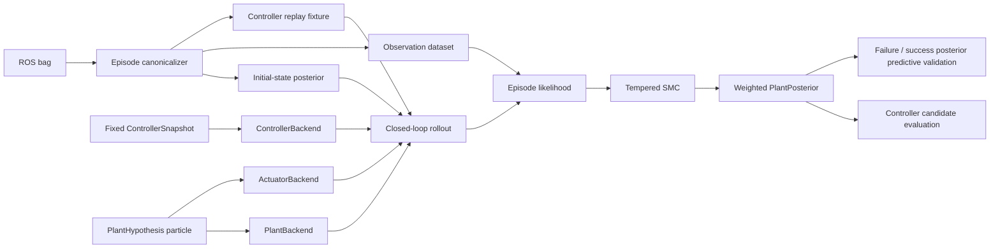

# Grape 実機同定基盤の再設計計画

## 0. 文書の目的

本計画は、`ProbTF-demo/ros/examples/grape-param-estim` にある現行実装を、次の目的に沿って再設計するための実装計画である。

- rosbag に記録された失敗軌道から、実機を最もよく説明する**実行可能なプラント候補の事後分布**を推定する。
- 飛行時に実際に使われた Grape の制御器を、仮想機体側の固定要素として再利用する。
- 単一の最適パラメータではなく、非識別性、多峰性、相関を保った weighted particle 集合を結果とする。
- 推定結果を、同じ制御器へ再接続して閉ループ再生できるようにする。
- 失敗 bag を同定の主データとし、成功 bag は主として posterior predictive sanity check に用いる。

この再設計は、現行コードを破棄して全面的に書き直すものではない。現行実装のうち、bag 読み出し、trajectory smoother、tempered SMC、provenance、artifact 出力、strict replay gate は再利用し、現在混在している役割を分離する。

---

## 1. 最初に固定する設計判断

### 1.1 「仮想機体」と「推定対象の実機」を別オブジェクトにする

飛行時の閉ループは、次の二者から成る。

1. **仮想機体を信じて入力を生成する制御器**
2. **その入力を受けて実際に動いた実機**

したがって、同定時の一つの particle は PID gain や controller 内部の nominal mass を含む「制御器候補」ではなく、固定された制御器に接続される「実機候補」とする。

制御器が飛行時に用いた nominal model と設定を `ControllerSnapshot` とし、これは同定中に固定する。一方、particle ごとに変化させる対象を `PlantHypothesis` とする。

概念的な閉ループは次である。

- `controller_command = controller(controller_snapshot, reference, simulated_feedback, controller_state)`
- `realized_wrench = actuator_model(controller_command, actuator_state, actuator_parameters)`
- `next_plant_state = plant_model(plant_state, realized_wrench, plant_parameters)`
- `simulated_feedback = sensor_model(next_plant_state)`

ここで、`controller_snapshot` は全 particle で共通であり、`plant_parameters` と `actuator_parameters` が particle ごとに異なる。

### 1.2 現行の `CounterfactualCandidate` を実機推定には使わない

現行の `CounterfactualCandidate` は、次を一つの vector に連結している。

- PID gain
- controller が用いる mass / inertia
- allocation scale
- thrust scale
- delay compensation

これは「新しい controller candidate の安全性評価」には使えるが、「飛行時の固定 controller のもとで実機を推定する問題」には適さない。

再設計後は、次の型を分離する。

- `ControllerSnapshot`: 飛行時に固定されていた制御器、nominal model、gain、limit、mode 設定
- `PlantParameters`: 実機の質量、重心、慣性、drag など
- `ActuatorParameters`: thrust scale、motor lag、delay、gimbal lag、bias など
- `EpisodeNuisance`: episode ごとの初期状態、外乱、sensor bias など
- `ControllerCandidate`: plant posterior を得た後に controller tuning を行う場合だけ使う

### 1.3 同定と controller tuning を別段階にする

同じ軌道の遅れを、実機の慣性、thrust scale、motor delay、PID gain のいずれでも説明できるため、最初から全部を同時に推定しない。

実装順は次とする。

1. 飛行時の controller を固定して、実機と actuator の事後分布を推定する。
2. 得られた plant posterior 全体に対して、新しい PID gain や controller parameter を反実仮想評価する。

---

## 2. 現行実装の評価

## 2.1 そのまま残すべき長所

現行実装には、すでに次の重要な要素がある。

- rosbag を直接読み、ROS master や `rosbag play` に依存しないデータ処理
- event time と bag record time の分離
- bag hash、source commit、frame、unit、dirty tree を含む fail-closed provenance
- EKF / RTS による coherent trajectory sample
- Student-t likelihood
- adaptive tempering、ESS、resample-move を含む SMC
- excitation rank と gauge の診断
- full weighted particle を意識した出力
- exact controller を surrogate と区別する identity / conformance gate
- synthetic sanity check と実 bag の解釈上の制限
- command を実推力とみなせない場合に effective parameter と明示する方針

これらは再設計後も維持する。

## 2.2 現在の中心モデルは閉ループ生成モデルではない

現行の `dynamics.py` と `particle_filter.py` の中心は、観測された運動から必要 wrench を計算し、観測または command 由来の wrench と照合する**逆動力学パラメータ推定**である。

これは有用な baseline であるが、今回の最終目的である、

> controller と候補実機を接続し、その候補が失敗軌道を生成する確率を評価する

という forward simulation にはなっていない。

この baseline は削除せず、`legacy_inverse_dynamics` または `inverse_dynamics_baseline` として明示的に残す。

## 2.3 `controller_replay.py` は良い出発点だが、抽象境界が不足している

現行の `controller_replay.py` には次の良い設計がある。

- Python surrogate を exact と呼ばない。
- teacher-forced replay と free-run replay を分ける。
- controller の integral state を明示的に持つ。
- mode change、reset、delay compensation を扱う。
- factual replay の RMSE / maximum error / event agreement gate がある。

一方、現在の `VectorPidSurrogate` は六軸独立 PID と簡略化された generalized wrench までであり、実際の `GimbalrotorController` が行う次の処理を再現しない。

- `PoseLinearController` の mode、landing、integration start、yaw 処理
- estimator と navigator からの状態・目標値取得
- nominal mass、inertia、CoG、rotor geometry に基づく allocation
- underactuated branch
- target vectoring force から base thrust と gimbal angle への変換
- spinal 側へ送る attitude gain と torque allocation matrix
- MCU 側の処理

したがって Python surrogate は、今後も smoke test、proposal、低 fidelity screening 専用とする。

## 2.4 exact oracle の境界は残すが、fidelity を分割する

`alternative_backends.py` には、外部 C++ executable または C ABI library を接続する exact-controller oracle、artifact hash、source commit、capability、bag-derived fixture、conformance gate がすでにある。

この方針は正しい。ただし、現在の protocol は PC controller、MCU、PWM までを一度に exact とするため、PC 側だけを正確に再現できても利用できない。

再設計後は fidelity を明示的に分ける。

- `pc_exact`: `PoseLinearController` と `GimbalrotorController` の PC 側を exact に再現し、`FourAxisCommand`、gimbal target、PID term、vectoring force まで出す。
- `pc_mcu_exact`: PC と spinal firmware の処理を再現し、motor / gimbal command または PWM まで出す。
- `actuator_calibrated`: command から実 wrench までの actuator model が独立に校正されている。
- `plant_closed_loop`: actuator output を受けて候補 plant を積分する。

各解析 task が必要とする capability を宣言し、存在しない下流 fidelity を上流の exactness と混同しない。

## 2.5 大きすぎる module を役割別に分割する

現在の `grape_bag_adapter.py`、`counterfactual.py`、`alternative_backends.py` は、複数の責務を一ファイルに持っている。機能を失わず、後述の package 構成へ段階的に分割する。

---

## 3. Grape controller に即した正しい境界

## 3.1 controller が信じる nominal model を固定する

`GimbalrotorController::controlCore()` は、基底の `PoseLinearController::controlCore()` で得た PID result を目標並進・角加速度として使い、`GimbalrotorRobotModel` から nominal inertia、mass、CoG と rotor geometry を取得して allocation を行う。

この nominal mass / inertia は、実機同定 particle の mass / inertia とは別物である。

- `controller_nominal_parameters`: 飛行時に controller が信じていた値。全 particle で固定。
- `plant_real_parameters`: 実際の挙動を説明する候補。particle ごとに変化。

この二つを同じ object や同じ YAML field で扱わない。

### 必須の回帰 test

- `PlantParameters` だけを変更しても、teacher-forced factual controller replay の出力は変化してはならない。
- `ControllerSnapshot` を変更すると controller output が変化しなければならない。

## 3.2 controller output と plant input の間に actuator model を置く

`/gimbalrotor/four_axes/command` は目標値であり、実 thrust sensor ではない。さらに PC controller は spinal 側へ gain や allocation 情報を送り、一部処理を MCU に委ねる。

したがって、forward model は必ず次の三層に分ける。

```text
ControllerBackend
    -> ControllerCommand
ActuatorBackend
    -> RealizedWrench
PlantBackend
    -> PlantState
```

`ControllerCommand` を直接 N または N m と解釈しない。

## 3.3 現在の bag に対しては二種類の posterior を区別する

actuator calibration がない episode では、物理 mass と thrust scale が分離できない可能性がある。この場合は、結果を次のいずれかとして明示する。

- `effective_plant_posterior`: command-to-motion の等価応答を表す posterior
- `calibrated_physical_plant_posterior`: 校正済み actuator wrench によって物理量として解釈できる posterior

物理量としての解釈 gate が通らないのに、出力 field 名だけを `mass` や `inertia` として確定値のように見せない。

---

## 4. 推定を三つの実行モードに分ける

## 4.1 `factual_controller_replay`

目的は、飛行時の controller をオフラインで正確に再現できることの確認である。

- controller への feedback は、実際に controller が使った online estimator state を使う。
- target、mode、gain change、reset、joint state、model snapshot を bag から与える。
- predicted command を記録済み command と比較する。
- このモードでは plant parameter を推定しない。

合格しなければ、closed-loop posterior に「exact controller 使用」と表示しない。

## 4.2 `open_loop_plant_identification`

目的は、記録済み command を同じまま候補 actuator / plant に与え、実機軌道を説明する posterior を推定することである。

- controller replay の誤差を plant inference へ混ぜない。
- 実際に送られた command が bag にある場合の第一 baseline とする。
- actuator と plant の gauge を明示する。

これは最初に実装すべき production inference mode である。

## 4.3 `closed_loop_plant_identification`

目的は、候補 plant が生成した feedback を固定 controller へ戻し、閉ループ全体で失敗軌道を説明する posterior を推定することである。

- controller は飛行時の `ControllerSnapshot` に固定する。
- particle ごとに controller state、actuator state、plant state を独立に持つ。
- recorded command を再利用せず、各 particle の simulated feedback から command を再計算する。
- `factual_controller_replay` gate を通った fidelity だけを用いる。

## 4.4 `posterior_controller_evaluation`

実機 posterior を得た後、controller gain 候補を評価するモードである。

- 入力は `PlantPosterior` と `ControllerCandidate`。
- 出力は success probability、failure probability、trajectory tube、saturation probability。
- plant identification と同じ particle vector に gain を混ぜない。

---

## 5. 目標アーキテクチャ



### 5.1 一つの particle が表すもの

```python
@dataclass(frozen=True)
class PlantHypothesis:
    model_id: str
    plant_parameters: np.ndarray
    actuator_parameters: np.ndarray
    disturbance_parameters: np.ndarray
```

状態は parameter vector と分ける。

```python
@dataclass
class RolloutState:
    controller_state: object
    actuator_state: np.ndarray
    plant_state: np.ndarray
    sensor_state: np.ndarray
```

static parameter posterior と episode-specific state posterior を混同しない。

---

## 6. controller replay contract

## 6.1 `ControllerSnapshot`

最低限、次を保存する。

```python
@dataclass(frozen=True)
class ControllerSnapshot:
    backend_id: str
    source_commit: str
    artifact_sha256: str
    nominal_model_sha256: str
    parameter_dump_sha256: str
    controller_rate_hz: float
    gains: Mapping[str, np.ndarray]
    limits: Mapping[str, np.ndarray]
    static_options: Mapping[str, object]
    nominal_mass: float
    nominal_cog: np.ndarray
    nominal_inertia: np.ndarray
    nominal_geometry: Mapping[str, np.ndarray]
```

`static_options` には少なくとも次を含める。

- `gimbal_dof`
- `gimbal_calc_in_fc`
- `hovering_approximate`
- `underactuate`
- `need_yaw_d_control`
- integration start height
- landing 関連設定
- estimate mode

## 6.2 `ControllerCoreInput`

C++ 側の pure core へ、一 tick ごとに次を渡す。

```cpp
struct ControllerCoreInput
{
  double stamp;
  double dt;
  Eigen::Vector3d position;
  Eigen::Vector3d velocity;
  Eigen::Matrix3d orientation;
  Eigen::Vector3d angular_velocity;
  Eigen::Vector3d target_position;
  Eigen::Vector3d target_velocity;
  Eigen::Vector3d target_acceleration;
  Eigen::Matrix3d target_orientation;
  Eigen::Vector3d target_angular_velocity;
  Eigen::Vector3d target_angular_acceleration;
  std::array<int, 6> control_mode;
  std::array<bool, 6> integration_enabled;
  int flight_state;
  bool force_landing;
  Eigen::VectorXd joint_positions;
};
```

実際の controller が参照する入力を全て列挙し、暗黙に ROS singleton、wall clock、global parameter server へ読みに行かせない。

## 6.3 `ControllerCoreState`

次を serialization 可能にする。

```cpp
struct PidCoreState
{
  double error_p;
  double error_i;
  double previous_error_i;
  double error_d;
  double result;
};

struct ControllerCoreState
{
  std::array<PidCoreState, 6> pid;
  bool start_roll_pitch_integration;
  double previous_stamp;
  int previous_flight_state;
};
```

実際に必要な state は controller source を調べて追加する。episode の途中から replay する場合、初期 state をゼロと仮定しない。

### 初期 state の優先順位

1. controller が publish した state snapshot から復元
2. bag 内の reset event より前から unscored pre-roll
3. PID debug term と gain から復元可能な成分を復元
4. 残りを episode nuisance posterior として推定
5. いずれも不可能なら exact replay gate を fail closed

## 6.4 `ControllerCoreOutput`

```cpp
struct ControllerCoreOutput
{
  Eigen::Matrix<double, 6, 1> pid_result;
  Eigen::Matrix<double, 6, 1> pid_p_term;
  Eigen::Matrix<double, 6, 1> pid_i_term;
  Eigen::Matrix<double, 6, 1> pid_d_term;
  Eigen::VectorXd target_vectoring_force;
  Eigen::VectorXd base_thrust;
  Eigen::VectorXd gimbal_angle;
  Eigen::MatrixXd torque_allocation_matrix_inverse;
  double target_roll;
  double target_pitch;
  double candidate_yaw_term;
  std::vector<int> events;
};
```

`FourAxisCommand` などの ROS message への変換は wrapper 側で行う。

---

## 7. jsk_aerial_robot 側の C++ 再設計

## 7.1 基本方針

controller 数式を Python へ複製しない。同じ C++ core を、

- 実機の ROS controller wrapper
- オフライン replay executable

の双方から呼ぶ single-source-of-truth 構成にする。

## 7.2 `PoseLinearController` の分割

現在 `PoseLinearController::controlCore()` が行う処理を、ROS 非依存の `PoseLinearControllerCore` へ移す。

### core に移すもの

- six-axis PID update
- position / velocity / acceleration mode
- yaw shortest-angle error
- feedforward
- z integrator nonnegative 制約
- roll / pitch integration start 条件
- landing / force-landing logic
- saturation と event 判定

### wrapper に残すもの

- ROS parameter 読み出し
- dynamic reconfigure callback
- estimator / navigator object からの値取得
- ROS time の取得
- message publish

`ros::Time::now()` は core 内で使用せず、wrapper が `stamp` と `dt` を渡す。

## 7.3 `GimbalrotorController` の分割

`GimbalrotorController::controlCore()` と command 生成処理を `GimbalrotorAllocationCore` へ移す。

### core に移すもの

- target acceleration の座標変換
- nominal mass / inertia / CoG と geometry に基づく allocation matrix
- pseudo inverse による target vectoring force
- underactuated branch
- base thrust と gimbal angle の計算
- target roll / pitch と candidate yaw term
- torque allocation matrix inverse

### wrapper に残すもの

- `RobotModel` から nominal model snapshot を構成する処理
- publisher
- spinal message への変換
- dynamic parameter event

## 7.4 live controller の挙動を変えない

refactor 前後で同じ入力 fixture を与えた場合、次が一致する golden test を作る。

- PID term
- `FourAxisCommand`
- target vectoring force
- gimbal target
- torque allocation matrix inverse
- mode / saturation / reset event

live wrapper は core を一回呼び、その出力を従来どおり publish するだけにする。

## 7.5 offline executable

最初は既存の `SubprocessExactControllerOracle` protocol を活かし、次を実装する。

```text
gimbalrotor_controller_replay
  handshake
  replay
```

ただし、一 particle ごとに process を起動しない。`replay` request は複数 episode、複数 particle の batch を受け取れる schema にする。

性能が問題になった段階で、既存の `CtypesExactControllerOracle` または pybind11 backend へ移行する。

## 7.6 PC と MCU を分離する

最初の executable は `pc_exact` とする。

- exact の終端は `FourAxisCommand` と gimbal target
- MCU より後ろは `ActuatorBackend` として扱う
- PWM まで再現できないことを failure ではなく fidelity metadata として記録する

その後、spinal firmware の同じ source を host build 可能にした時点で `pc_mcu_exact` を追加する。

---

## 8. rosbag と replay fixture

## 8.1 時刻 grid を分離する

現在の 20 Hz または 50 Hz の共通 grid を、全処理に使わない。

- `controller_tick_grid`: 実際の controller update timestamp
- `plant_integration_grid`: controller tick と同じか、それより細かい integration grid
- `observation_grid`: mocap、IMU などの観測時刻
- `likelihood_grid`:相関を重複計上しないための評価時刻
- `report_grid`: CSV、plot、analysis bag 用の表示時刻

controller の PID integral は `controller_tick_grid` で更新する。report を 20 Hz にしても controller 自体を 20 Hz で動かしてはならない。

## 8.2 episode の開始時刻を二つ持つ

```yaml
replay_start_offset_s: 10.0
score_start_offset_s: 18.0
score_end_offset_s: 26.0
```

- `replay_start`: controller state と actuator state を再構成するための pre-roll 開始
- `score_start`: likelihood を掛け始める時刻

現行のように失敗直前の短区間だけを切り出す場合でも、controller state はそれ以前から再生する。

## 8.3 controller replay sufficiency audit

新しい script を追加する。

```text
audit_grape_controller_replay.py
```

各 bag について、次を `AVAILABLE`、`DERIVABLE`、`MISSING` に分類する。

- controller tick
- controller が実際に使った estimator state
- navigator target
- control mode
- integration enable / reset event
- force landing / flight state
- all PID gain and limit changes
- nominal URDF / model / geometry snapshot
- joint state
- recorded `FourAxisCommand`
- recorded gimbal command
- PID debug term
- vectoring force
- torque allocation matrix
- spinal / PWM channel

結果を `controller_replay_audit.json` に保存し、必要 channel が欠落している場合は exact replay を開始しない。

## 8.4 将来収録用の replay message

既存 bag の復元だけに頼らず、controller から二種類の debug message を publish する。

### static または変更時のみ

`GimbalrotorControllerReplayMetadata`

- source commit
- controller config
- gain / limit
- nominal model
- geometry hash
- controller rate
- fidelity setting

### controller tick ごと

`GimbalrotorControllerReplayFrame`

- controller input
- controller state before / after
- controller output
- mode / reset / saturation event

本番制御に影響しない debug publisher とし、必要に応じて compile option または ROS parameter で有効化する。

## 8.5 bag から controller が見ていない情報を replay input に使わない

mocap は likelihood や offline smoother には使えるが、飛行時 controller が別の onboard estimator state を使っていた場合、mocap trajectory を factual controller replay の feedback に代用しない。

controller replay と observation likelihood の source を明確に分ける。

---

## 9. Python package の目標構成

```text
src/grape_param_estim/
  data/
    episode.py
    bag_reader.py
    event_scheduler.py
    controller_fixture.py
    replay_audit.py
    provenance.py

  controller/
    contracts.py
    snapshot.py
    python_surrogate.py
    external_oracle.py
    replay_gate.py

  plant/
    parameters.py
    actuator.py
    rigid_body.py
    disturbance.py
    sensor.py

  forward/
    open_loop.py
    closed_loop.py
    rollout.py
    cache.py

  inference/
    prior.py
    transforms.py
    tempered_smc.py
    likelihood.py
    posterior.py
    identifiability.py

  validation/
    failure_event.py
    posterior_predictive.py
    success_gate.py
    controller_design.py
    support.py
    trajectory_tube.py

  output/
    artifacts.py
    analysis_bag.py
    reports.py
    manifest.py

  legacy/
    inverse_dynamics.py
    inertial_particle_filter.py
    effective_response.py
```

一度に全 file を移動せず、compatibility import を置いて段階的に移行する。

---

## 10. 現行 file ごとの扱い

### `episode.py`

- 維持する。
- canonical event dataset と deterministic ordering を追加する。
- controller、observation、report の grid を分離する。

### `state_smoother.py`

- 維持する。
- initial-state posterior と observation uncertainty の生成に使う。
- free-run 中の feedback として未来の smoothed state を注入しない。

### `inference.py`

- static parameter inference の主 backend に昇格する。
- `TemperedResampleMoveSmc` を package の標準 SMC とする。
- multiple episode likelihood、cache、parallel batch evaluation を追加する。

### `particle_filter.py`

- 現行の inverse-dynamics baseline として残す。
- 新しい closed-loop inference の主 engine にはしない。
- file 名または model ID で legacy baseline と分かるようにする。

### `dynamics.py`

- 現在の inverse-wrench model を baseline として残す。
- 新たに forward integration 用の `RigidBodyPlantBackend` を別 file に作る。

### `controller_replay.py`

次へ分割する。

- contracts と dataclass
- Python surrogate
- exact external backend adapter
- replay metrics / conformance gate

free-run の plant callback は `ClosedLoopForwardModel` 側へ移し、controller と plant の責務を分ける。

### `alternative_backends.py`

次へ分割する。

- factor graph smoother
- PMMH
- structured inverse dynamics
- exact controller oracle
- conditional candidate gate

巨大な optional-backend registry にしない。

### `effective_response.py`

- 低 fidelity surrogate、proposal、delay / lag 初期化に使う。
- exact posterior likelihood の代替にはしない。
- surrogate だけで candidate を棄却する場合は delayed-acceptance などの補正を入れる。

### `counterfactual.py`

次へ分割する。

- controller candidate evaluation
- trajectory tube
- support diagnostics
- probability calibration
- rollout result

plant posterior を推定する処理は新しい `forward` と `inference` package へ移す。

### `grape_bag_adapter.py`

次へ分割する。

- bag reading
- fixture building
- vertical slice orchestration
- analysis message construction
- analysis bag writing

### `artifacts.py`、`manifest.py`

- 維持する。
- controller artifact hash、plant backend hash、likelihood model ID、full posterior particle file hash を追加する。

---

## 11. forward model interface

## 11.1 controller

```python
class ControllerBackend(Protocol):
    identity: ControllerBackendIdentity

    def reset(
        self,
        snapshot: ControllerSnapshot,
        initial_state: ControllerState,
    ) -> None:
        ...

    def step(self, item: ControllerInput) -> ControllerOutput:
        ...
```

## 11.2 actuator

```python
class ActuatorBackend(Protocol):
    model_id: str

    def reset(self, initial_state: np.ndarray) -> None:
        ...

    def step(
        self,
        command: ControllerCommand,
        parameters: np.ndarray,
        dt: float,
    ) -> RealizedWrench:
        ...
```

初期実装は次を含む。

- common thrust scale
- first-order motor lag
- pure delay
- per-rotor scale は必要になった段階で追加
- gimbal angle bias / lag
- saturation

## 11.3 plant

```python
class PlantBackend(Protocol):
    model_id: str

    def reset(self, initial_state: np.ndarray) -> None:
        ...

    def step(
        self,
        wrench: RealizedWrench,
        parameters: np.ndarray,
        dt: float,
    ) -> PlantState:
        ...
```

最初は rigid body とし、gimbal 内部運動を固定慣性へまとめる。次段階で articulated model を追加する。

## 11.4 observation

```python
class ObservationBackend(Protocol):
    model_id: str

    def predict(self, state: PlantState) -> PredictedObservation:
        ...
```

pose、velocity、IMU specific force などを出力する。

---

## 12. parameterization

## 12.1 model profile を明示する

### `effective_closed_loop_v1`

現在の uncalibrated bag に用いる。

- specific thrust authority
- rotational authority
- delay
- time constant
- CoG-induced coupling の識別可能な成分
- drag / bias の低次元項

raw mass と thrust scale を無理に分離しない。

### `calibrated_rigid_body_v1`

calibrated actuator wrench または独立 calibration がある場合に用いる。

- mass
- CoG
- symmetric inertia
- calibrated actuator uncertainty

### `articulated_gimbalrotor_v1`

joint-dependent inertia が必要になった段階で追加する。

## 12.2 raw parameter と derived identifiable quantity を同時に保存する

full posterior particle は raw parameter space に保存できるが、report では次を優先する。

- identifiable combination
- posterior correlation
- null direction
- prior / bound dominated parameter
- posterior predictive trajectory

marginal interval だけで実機像を表現しない。

---

## 13. likelihood

## 13.1 episode likelihood

一つの episode について、次の成分を分けて記録する。

- pose residual
- orientation residual
- velocity residual
- IMU residual
- command residual: factual controller replay のみ
- failure event residual
- saturation / mode event residual

総 log likelihood を返すだけでなく、component ごとの値を diagnostics に残す。

## 13.2 time correlation

forward simulation は controller rate で行い、likelihood は相関を考慮した疎な grid で評価する。

現行の「重なった Savitzky--Golay window を独立 evidence として重複計上しない」という方針は維持する。

将来、必要なら block covariance または state-space residual model を追加する。

## 13.3 initial-state uncertainty

trajectory smoother から複数の initial-state sample を取得し、parameter particle ごとの likelihood を initial-state posterior について marginalize する。

現行の `marginalize_trajectory_log_likelihood` を再利用できる。

## 13.4 failure data

最初は失敗時刻までの trajectory likelihood を使い、衝突や emergency stop 後のデータは censor する。

次段階で、次を追加する。

- failure type
- failure occurrence
- failure time
- safety boundary crossing

失敗を二値 label だけに縮約せず、失敗へ至る trajectory を主 evidence とする。

## 13.5 success data

初期版では success bag を posterior update に含めず、次の held-out gate に使う。

- observed successful trajectory が posterior predictive 95% envelope から大きく外れない。
- posterior particles の大部分が success episode で不必要な failure を起こさない。
- failure bag から得た補正が、正常領域を破壊していない。

後に必要なら、弱い likelihood または hierarchical multi-episode model として追加する。

---

## 14. inference

## 14.1 batch tempered SMC を主方式にする

閉ループ rollout の likelihood は episode 全体へ依存するため、現行の一観測ずつの inertial particle filter より、static parameter に対する batch tempered SMC が自然である。

```text
prior particles
  -> episode-wide rollout likelihood
  -> adaptive tempering
  -> resampling
  -> MCMC move
  -> rerun changed particles
  -> posterior
```

`inference.py` の generic `TemperedResampleMoveSmc` を基礎にする。

## 14.2 multiple episode

shared plant parameter と episode nuisance を分ける。

- plant / actuator parameter: episode 間で共有
- initial state、wind bias、sensor bias: episode ごと

失敗 episode の log likelihood を加算し、success episode は初期版では validation に回す。

## 14.3 cache

forward rollout cache key に次を含める。

- source bag hash
- normalized episode hash
- controller snapshot hash
- controller backend artifact hash
- plant backend model ID
- parameter vector hash
- initial-state sample ID
- process-noise seed
- source commit

MCMC move と複数 chain で同じ rollout を再計算しない。

## 14.4 parallelization

一 particle ごとに ROS node を起動しない。

優先順位は次とする。

1. C++ batch executable
2. C ABI / pybind11 persistent backend
3. process pool による episode / particle batch
4. full ROS process backend は conformance と compatibility test のみ

## 14.5 multi-fidelity

`effective_response.py` や Python surrogate を次に使える。

- proposal covariance の初期化
- delay / time constant の粗探索
- low-probability 領域の delayed acceptance
- smoke test

ただし surrogate の score を exact likelihood として保存しない。最終 weight は required fidelity の rollout で決める。

---

## 15. 95% posterior の表現

出力の中心は次の weighted empirical law とする。

```text
PlantPosterior
  particles: PlantHypothesis[N]
  weights: float[N]
  model_id
  prior_id
  likelihood_id
  controller_snapshot_id
```

95%領域は、単純な各 parameter の marginal interval だけでなく、次を保存する。

- full weighted particles
- 95% highest-posterior-mass particle subset
- joint covariance
- pairwise correlation
- multimodality diagnostic
- identifiable derived quantities
- posterior predictive 95% trajectory envelope
- failure probability distribution

「実機が客観的に95%の確率でこの範囲に存在する」ではなく、使用した prior、model、likelihood、bag のもとでの 95% credible set と記録する。

---

## 16. ProbTF との接続

ProbTF に保存すべきものと、保存すべきでないものを分ける。

### ProbTF へ誘導できるもの

- `fc` から CoG への不定座標変換
- sensor extrinsic の posterior
- posterior predictive pose law

### ProbTF に無理に格納しないもの

- mass
- inertia tensor
- thrust scale
- motor time constant
- PID gain

これらは `PlantPosterior` または専用 message / artifact に保存する。ProbTF は、plant posterior から誘導される座標変換 law の公開先とする。

---

## 17. 新しい設定 schema の例

```yaml
schema: grape_plant_assimilation/v2
seed: 7

controller:
  backend: external_cpp
  fidelity: pc_exact
  snapshot_policy: frozen_from_bag
  executable: gimbalrotor_controller_replay
  require_factual_replay_pass: true
  nominal_model_policy: frozen

plant:
  model: effective_closed_loop_v1
  integration_rate_hz: 400.0
  parameters:
    - name: specific_thrust_scale
      prior:
        type: bounded_uniform
        lower: 5.0
        upper: 20.0
    - name: motor_time_constant
      prior:
        type: bounded_log_uniform
        lower: 0.01
        upper: 0.30
    - name: command_delay
      prior:
        type: bounded_uniform
        lower: 0.0
        upper: 0.20

observation:
  pose_likelihood: student_t
  orientation_residual: so3_log
  likelihood_rate_hz: 10.0
  censor_after_failure: true

inference:
  algorithm: tempered_smc
  particle_count: 1024
  target_ess_fraction: 0.70
  resample_ess_fraction: 0.50
  mcmc_steps: 2
  chain_count: 4

validation:
  credible_probability: 0.95
  failure_bags_for_inference: true
  success_bags_for_inference: false
  success_bags_for_validation: true

episodes:
  - episode_id: failure_04
    bag: flight_failure_04.bag
    role: inference_failure
    replay_start_offset_s: 10.0
    score_start_offset_s: 18.0
    score_end_offset_s: 25.0

  - episode_id: hover_07
    bag: successful_hover_07.bag
    role: validation_success
    replay_start_offset_s: 40.0
    score_start_offset_s: 45.0
    score_end_offset_s: 53.0
```

---

## 18. 出力 artifact

一 run につき次を保存する。

```text
run/
  run_manifest.json
  controller_snapshot.json
  controller_replay_audit.json
  factual_replay_report.json
  posterior_particles.npz
  posterior_summary.json
  posterior_hpd95.csv
  identifiability_report.json
  likelihood_components.csv
  posterior_predictive.npz
  failure_validation.json
  success_validation.json
  REPORT.md
```

### `posterior_particles.npz`

- 全 particle
- normalized weight
- log likelihood
- raw parameter
- derived identifiable quantity
- model ID

代表 particle だけを残した ROS message は可視化用とし、完全 posterior の正本にはしない。

### analysis bag

必要な場合だけ別途生成する。

- `/analysis/grape/plant_posterior_summary`
- `/analysis/grape/posterior_predictive/pose`
- `/analysis/grape/posterior_predictive/failure_probability`
- `/analysis/grape/factual_controller_replay`
- `/probtf/grape/cog`

---

## 19. 実装フェーズ

## Phase 0: 現行 baseline の凍結

- [ ] 現行 synthetic sanity test を固定する。
- [ ] 現行 real-bag vertical slice の output hash を保存する。
- [ ] model ID を `inverse_dynamics_baseline_v1` とする。
- [ ] 現行結果を削除せず、比較対象として残す。
- [ ] controller / plant / actuator の用語を README で分離する。

### 完了条件

- 現行 pipeline が再設計中も同じ command で実行できる。
- baseline artifact が再現可能である。

## Phase 1: domain model の分離

- [ ] `ControllerSnapshot` を追加する。
- [ ] `PlantHypothesis` を追加する。
- [ ] `ActuatorParameters` を追加する。
- [ ] `EpisodeNuisance` を追加する。
- [ ] `ControllerCandidate` を plant inference path から外す。
- [ ] controller nominal parameter と inferred plant parameter が別 schema であることを test する。

### 完了条件

- plant particle を変更しても factual controller replay output が変わらない。

## Phase 2: bag replay audit と fixture

- [ ] `audit_grape_controller_replay.py` を実装する。
- [ ] `ControllerReplayFixture` schema を追加する。
- [ ] `replay_start` と `score_start` を分ける。
- [ ] controller tick、observation、report grid を分ける。
- [ ] bag-derived fixture の hash を manifest に追加する。
- [ ] current bag 4、7、8 の不足 channel 一覧を生成する。

### 完了条件

- exact replay に必要な入力の有無が bag ごとに機械判定される。

## Phase 3: PC-side exact controller core

- [ ] `PoseLinearControllerCore` を実装する。
- [ ] `GimbalrotorAllocationCore` を実装する。
- [ ] live ROS wrapper が core を呼ぶようにする。
- [ ] explicit `stamp` / `dt` injection を行う。
- [ ] controller state import / export を実装する。
- [ ] `gimbalrotor_controller_replay` executable を実装する。
- [ ] oracle identity に `fidelity=pc_exact` を追加する。
- [ ] required capability を task ごとに判定する。

### 完了条件

bag-derived fixture に対して、少なくとも次が frozen threshold 内で一致する。

- PID term
- `FourAxisCommand`
- target vectoring force
- gimbal target
- mode / reset / saturation event

## Phase 4: open-loop plant inference

- [ ] `ActuatorBackend` を実装する。
- [ ] `RigidBodyPlantBackend` を実装する。
- [ ] recorded command を入力する open-loop rollout を実装する。
- [ ] current uncalibrated bag 用に `effective_closed_loop_v1` を実装する。
- [ ] calibrated synthetic bag 用に `calibrated_rigid_body_v1` を実装する。
- [ ] multiple initial-state sample marginalization を実装する。
- [ ] batch tempered SMC へ接続する。

### 完了条件

- synthetic data で識別可能な parameter combination を回収できる。
- mass / thrust scale gauge がある設定では posterior ridge または unidentifiable report が出る。
- 同じ seed と artifact で posterior hash が一致する。

## Phase 5: closed-loop plant inference

- [ ] controller、actuator、plant を一つの event scheduler で接続する。
- [ ] particle ごとの controller state を独立に持つ。
- [ ] recorded command を closed-loop rollout に流用しない。
- [ ] controller rate で PID を更新する。
- [ ] likelihood grid だけを thinning する。
- [ ] rollout cache と batch backend を追加する。

### 完了条件

- `pc_exact` factual replay gate が通らない run は closed-loop exact inference を開始しない。
- open-loop と closed-loop の model ID、結果、解釈が区別される。

## Phase 6: failure event likelihood

- [ ] failure detector interface を追加する。
- [ ] failure type と failure time を artifact に保存する。
- [ ] failure 後の観測を censor する。
- [ ] trajectory likelihood と event likelihood を分けて出力する。
- [ ] held-out failure bag で posterior predictive validation を行う。

### 完了条件

- 失敗を再現しない particle と、観測に近い時刻・形態で再現する particle が区別される。

## Phase 7: success sanity gate

- [ ] success bag を inference から分離する。
- [ ] posterior predictive coverage を計算する。
- [ ] posterior failure probability を success episode 上で評価する。
- [ ] normal region を壊す posterior に警告または reject gate を付ける。

### 完了条件

- failure bag から得た posterior が success bag を破壊していないことを機械判定できる。

## Phase 8: controller tuning

- [ ] `ControllerCandidate` を controller design package へ移す。
- [ ] plant posterior 上で candidate ごとの success probability を評価する。
- [ ] recommendation は exactness、support、calibration、success gate が全て通る場合だけ出す。

---

## 20. test 計画

## 20.1 unit test

- [ ] PID clamp と integral update が C++ `PID` と一致する。
- [ ] z integral の非負制約が一致する。
- [ ] yaw angle wrapping が一致する。
- [ ] mode change と reset が一致する。
- [ ] allocation matrix が既存 controller と一致する。
- [ ] underactuated branch が一致する。
- [ ] actuator delay / lag の既知解と一致する。
- [ ] rigid-body integration の conservation / equilibrium test。

## 20.2 golden factual replay

- [ ] 同一 fixture の反復実行で出力 hash が一致する。
- [ ] command timestamp が一致する。
- [ ] continuous channel が threshold 内で一致する。
- [ ] event agreement が 1.0 である。
- [ ] artifact / source identity が異なる executable を reject する。

## 20.3 synthetic recovery

- [ ] calibrated case で物理 parameter を回収する。
- [ ] uncalibrated case で gauge を正しく報告する。
- [ ] multimodal synthetic case で一つの Gaussian へ潰れない。
- [ ] prior bounds を変えると provenance と posterior が変化する。

## 20.4 failure / success validation

- [ ] inference に使っていない failure bag で predictive validation。
- [ ] success bag で false failure probability を確認する。
- [ ] failure 後を likelihood に含めないことを確認する。
- [ ] future observation が online-prefix mode に漏れないことを確認する。

## 20.5 architecture regression

- [ ] plant parameter を変えても factual controller replay は不変。
- [ ] controller snapshot を変えると command は変化。
- [ ] open-loop mode では controller backend を呼ばない。
- [ ] closed-loop mode では recorded command を使用しない。
- [ ] Python surrogate が exact gate を通らない。

---

## 21. risk register

### R1. controller が実際に見た state が bag にない

対策:

- replay audit を fail closed にする。
- future bag 用 replay frame を追加する。
- current bag は `pc_exact unavailable` とし、open-loop inference を先に進める。

### R2. controller integral state が不明

対策:

- reset 以前から pre-roll する。
- debug PID term から復元する。
- nuisance posterior として扱う。
- zero 初期化を暗黙に採用しない。

### R3. PC と MCU の境界

対策:

- fidelity を `pc_exact` と `pc_mcu_exact` に分ける。
- MCU 未接続時は actuator uncertainty に吸収する。
- PWM exactness を PC exactness の必須条件にしない。

### R4. mass / thrust scale gauge

対策:

- current bag では effective model を既定にする。
- physical model は independent calibration gate が通った場合だけ使用する。
- null direction と derived quantity を report する。

### R5. controller rate と resampling rate の混同

対策:

- controller tick、integration、likelihood、report grid を型と field 名で分離する。
- 20 Hz report grid で PID を更新する実装を禁止する test を置く。

### R6. computation cost

対策:

- process 起動を particle 単位にしない。
- batch C++ runner、cache、persistent backend を使う。
- surrogate は proposal と delayed acceptance に限定する。

### R7. geometry version mismatch

対策:

- nominal geometry と plant geometry を snapshot / hypothesis へ明示する。
- bag TF、URDF、source commit、geometry hash を記録する。
- 暗黙の固定 geometry 適用を禁止する。

### R8. hover data の excitation 不足

対策:

- identifiable subspace だけを報告する。
- posterior が prior / bounds dominated であることを明示する。
- failure maneuver がどの parameter direction を励起したかを report する。

---

## 22. 実装上の禁止事項

- controller nominal mass / inertia を plant particle と同じ field で変化させない。
- PID gain と plant parameter を最初の inference で同時推定しない。
- Python surrogate を exact と表示しない。
- `FourAxisCommand.base_thrust` を無条件に N と解釈しない。
- full ROS graph を particle ごとに起動しない。
- report grid を controller integration grid として使わない。
- closed-loop rollout で recorded command を再利用しない。
- unknown controller integral state を暗黙に zero としない。
- success bag を failure bag と同じ重みで無条件に posterior update へ入れない。
- marginal 95% interval だけを posterior の正本としない。
- mass、inertia、thrust scale を ProbTF edge へ無理に格納しない。
- exactness、calibration、support、held-out validation gate が通る前に controller recommendation を出さない。

---

## 23. 最初に作る最小 vertical slice

最初の実装目標は、次の一続きとする。

1. bag 7 の controller replay audit を実行する。
2. PC-side `PoseLinearControllerCore` と `GimbalrotorAllocationCore` を作る。
3. teacher-forced replay で `FourAxisCommand` と PID term を再現する。
4. bag 4 の recorded command を actuator + effective plant へ与える open-loop posterior を作る。
5. weighted particle と posterior predictive trajectory を出力する。
6. bag 7 または bag 8 を success sanity check に使う。
7. その後に closed-loop particle rollout へ進む。

この順序なら、現在の bag で controller fixture が不足していても、open-loop plant inference を先に進められる。一方、closed-loop exactness を曖昧な surrogate で代用することもない。

---

## 24. Definition of Done

再設計の第一版は、次を満たしたとき完了とする。

- 飛行時 controller の snapshot と推定対象 plant が別 object である。
- current inverse-dynamics estimator が baseline として再現可能である。
- `pc_exact` controller replay が bag-derived fixture に対して conformance gate を持つ。
- recorded-command open-loop plant posterior が実行できる。
- exact-controller closed-loop posterior が gate 付きで実行できる。
- full weighted particles と joint 95% credible subset が保存される。
- failure trajectory と failure event の predictive validation がある。
- success bag に対する sanity gate がある。
- actuator calibration がない結果は effective model と表示される。
- source commit、bag hash、controller artifact、model ID、prior、likelihood、seed が全 artifact に記録される。
- recommendation は全 gate 通過時だけ生成される。

